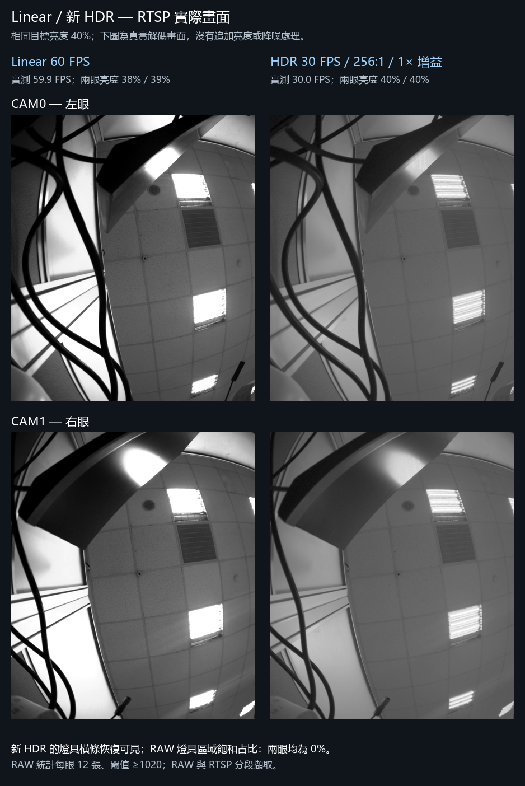

# SC132GS 雙目相機：RUBIK Pi 3 / QCS6490

GS130WI 上兩顆 SC132GS 的 Linux V4L2 驅動、曝光控制、HDR / Linear
模式切換，以及 C++20 H.265 RTSP 串流程式。

兩眼共用 2-lane MIPI 接線與 Device Tree，每眼輸出 1088×1280 RGGB RAW10。
RTSP 將各眼水平鏡像後左右並排，完整解析度為 2176×1280。

| 模式 | 預設 FPS | 曝光與顯示 |
| --- | ---: | --- |
| Linear | 60 | Linear 曝光控制與既有灰階轉換 |
| HDR | 30 | 感測器 single-frame HDR、1× 類比增益、受管理的 TOTAL / SECOND 比例與 RAW10 顯示曲線 |

HDR 的要求比例預設為 256；AE 調整 TOTAL，驅動同步更新 SECOND 與
HDRC 係數。顯示曲線在量化成 8-bit 前處理 RAW10 灰階值，使用此實機
profile 量測的黑位 52 與 gamma 0.38。原始 RAW 擷取資料保留不變。
參數單位、量測結果與限制見 [HDR_RATIO.md](outputs/sc132gs_v4l2_probe/HDR_RATIO.md)。

## 使用文件

- [硬體接線、開機與相機 bring-up 教學](outputs/sc132gs_v4l2_probe/SC132GS_QCS6490_CAMERA_BRINGUP_TUTORIAL.zh-TW.md)
- [驅動、V4L2 工具與 Windows viewer](outputs/sc132gs_v4l2_probe/README.md)
- [HDR / Linear 模式控制器與 Mermaid UML](outputs/sc132gs_v4l2_probe/MODE_SWITCH.md)
- [RTSP 建置、部署與驗證](outputs/stereo_h265_rtsp/README.md)
- [最新 HDR / Linear 截圖與 RAW 驗證](outputs/stereo_h265_rtsp/diagnostics/hdr-managed-live-v2-20261006/README.md)
- [初期 HDR 導入紀錄](outputs/sc132gs_hdr/README.md)

子目錄文件包含不同日期的實驗紀錄；目前 HDR 曝光設計以
`HDR_RATIO.md` 的 managed TOTAL / SECOND 說明為準。

## 建置

在 Linux / RUBIK Pi 上安裝編譯工具、對應執行中核心的 headers，以及
GStreamer 開發套件。以下指令從 repository 根目錄執行：

```sh
sudo apt install build-essential cmake pkg-config \
  libgstreamer1.0-dev libgstreamer-plugins-base1.0-dev \
  libgstrtspserver-1.0-dev gstreamer1.0-plugins-good \
  gstreamer1.0-plugins-bad

make -C outputs/sc132gs_v4l2_probe module tools
cmake -S outputs/stereo_h265_rtsp -B build/rtsp \
  -DCMAKE_BUILD_TYPE=Release -DBUILD_TESTING=ON
cmake --build build/rtsp -j2
ctest --test-dir build/rtsp --output-on-failure
```

RTSP 使用 Qualcomm 的 `v4l2h265enc`，需要板端 CAMSS、VPU 與相機
pipeline。建置後的安裝、Device Tree 與 FSYNC 設定請依上方部署文件執行。

## 已部署板端的模式操作

```sh
sudo sc132gs-ctl set-mode linear
sudo sc132gs-ctl set-mode hdr
sudo sc132gs-ctl set-brightness 40
sc132gs-ctl mode
sudo sc132gs-ctl status
```

控制器管理兩眼、曝光設定與串流重啟。切換期間 RTSP 連線會中斷，
播放器需重新連線。VLC 使用 `rtsp://<Rubik-Pi-IP>:8554/stereo`；
監聽位址依 RTSP 啟動設定決定。

## 實機驗證快照

2026-10-06 的驗證平台為 RUBIK Pi 3、`6.8.0-1084-qcom` 核心與雙顆
SC132GS。四項 CTest 通過；兩眼模式切換、控制範圍拒絕、RAW 擷取及
RTSP 解碼均有紀錄。最新 HDR profile 在該場景的兩眼燈具 ROI 中，
RAW10 ≥1020 的比例為 0%；Windows RTP/TCP 接收約 29.93 FPS。
這些數值是當次實機與場景的結果；VLC 顯示 FPS 尚未量測。



圖片與 JSON 證據隨 repository 保存；大型原始 RAW、建置產物及韌體映像
不包含在 Git 中。歷史診斷腳本有當時的主機路徑與板端目錄，重跑前需
配合執行環境調整。

## 匯入來源

本 repository 從既有工作區抽出三個相機目錄與相關提交歷史，保持其
相對位置及程式內容。最新來源提交為 `2899007`，相機歷史中的對應提交
為 `0d4bc30`。抽出目錄後 Git tree 與父提交改變，因此 commit SHA 不同。
各來源檔案原有的授權與著作權標示保留。
