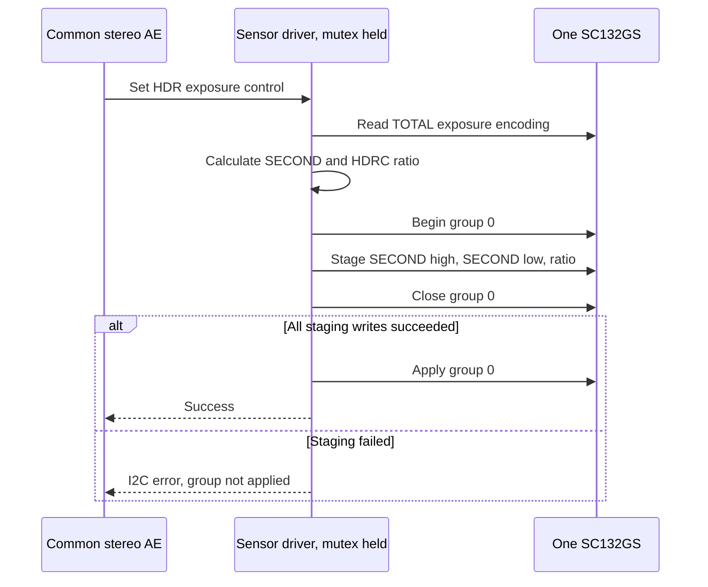

# HDR exposure and HDRC ratio

SC132GS Datasheet V2.6, page 21, table 2-3 specifies:

```
TOTAL  = { 3e00[3:0], 3e01, 3e02 }   // 1/16-line encoding
SECOND = { 3e31, 3e32 }               // 1/16-line encoding
5400   = round(255 * (TOTAL - SECOND) / TOTAL)
```

The deployed driver previously inherited the D-Robotics table's fixed
`5400=80`, while its exposure callback updated only `3e31/32`. With
`TOTAL=5d40` and `SECOND=2200`, the formula gives `A2`, not `80`.
The reference table itself also uses the fixed ratio at its initial exposure;
this is an inherited convention, not a ratio calibrated for this board.

The driver now reads the current TOTAL encoding and calculates the ratio for
every HDR exposure update, including the cached exposure applied at STREAMON.
It rejects a zero TOTAL, a SECOND at or above TOTAL, and a SECOND that does
not fit the 16-bit registers. No floating-point arithmetic is used.

Exposure and ratio writes use sensor group 0 (`3800=00`, close with `10`,
apply with `60`), as described on page 28, table 2-8. The driver holds its
existing sensor mutex for the whole transaction. Failed staging does not
launch the group; the original I2C error is returned. This grouping is within
one sensor; it does not prove simultaneous exposure changes between eyes.



## Exposure control units

The existing HDR control encoding is retained for compatibility:
`SECOND = control * 4`. Combined with the datasheet's 1/16-line register
encoding, one control step represents **1/4 nominal line**. Thus HDR control
808 encodes 202 lines, and control 2176 encodes 544 lines. Linear control
808 encodes 808 lines. The legacy status field `exposure_lines` therefore
does not have the same unit in both modes; do not copy it across modes.

These are decoded register units, not measured exposure durations. The HDR
PLL and external-trigger offsets have not been electrically characterized;
the existing rejection of a positive HDR `max-exposure-us` remains correct.
The existing 8..2176 HDR control bound is preserved. This change does not
alter TOTAL exposure, gain, trigger cadence, dimensions or Device Tree.

## Fixed-exposure RAW comparison

`hdr-ratio-check.py` captures A/B/A at the currently held common exposure and
gain with the AE process stopped. It uses A=`80`, B=the computed value, then
returns to A. Both cameras discard 60 warm-up frames and save 12 complete
RAW10 frames per condition. Its finally block stops temporary capture/FSYNC
owners and restarts the existing HDR service. Run as root on the board:

```
python3 hdr-ratio-check.py /path/to/diagnostic-output
```

The 2026-10-06 comparison used control 2176, gain index 60 and B=`A2`.
All 72 frames were complete (1,740,800 bytes each), with distinct hashes.
Statistics use original 10-bit samples. The preview applies the same fixed
0..1023 display range and 2x2 RGGB luminance conversion to all conditions.
It uses neither percentile normalization nor spatial denoising.

| Eye | Mean RAW10, A before | Mean RAW10, B | Mean RAW10, A after | Saturated %, A / B |
| --- | ---: | ---: | ---: | ---: |
| CAM0 | 411.205 | 410.868 | 411.009 | 9.109 / 9.092 |
| CAM1 | 450.586 | 450.410 | 450.232 | 10.916 / 10.910 |

Saturation is RAW10 >= 1020. Average absolute B-versus-A change was smaller
than the repeated-A difference for both cameras. This scene provides no
evidence of a meaningful highlight or noise improvement from the ratio
change. In particular, it does **not** establish that `5400` caused the
right-eye highlight difference. HDRC is documented as HDR noise calibration,
not as a standalone highlight tone-mapping control.

See `hdrc-ratio-evidence-20261006/` for readbacks, frame hashes, statistics and
the fixed-scale preview. Large original RAW captures remain on the board at
`/home/ubuntu/sc132gs-hdrc-ratio-20261006/ab-before/`.
`hdr-ratio-analyze.py OUTPUT_DIRECTORY` reproduces the statistics and preview
from those six RAW files; it requires NumPy and Pillow.

## Driver validation and rollback

`hdr-ratio-control-check.py` checks both sensors through V4L2 at controls
8, 200, 808, 1492 and 2176, with repeated transitions. It also checks the
control boundaries and restores the original exposure/gain and AE state.
This is a hardware integration check, not a claim of measured dynamic range.

The new module compiled against `6.8.0-1084-qcom` and was loaded after a reboot.
The loaded module and installed file have matching srcversion
`EF3B151E0A4E34A35BA74F1`; the deployed module SHA256 is
`0d3b2ea4a37fe6a13febbf006b324a61500eb28a42b4e2e25a8053a691bceed9`.

On both eyes, controls 8/200/808/1492/2176 produced ratios
`ff/f6/dc/bf/a2`. Repeated transitions and V4L2 clamp handling for requests
0/2177 passed, including readback of the matching SECOND/ratio pair. A prior
live group test confirmed that staged values stayed inactive until launch.

All four existing CTest cases passed. Real capture after driver installation
produced 300 contiguous pairs in each mode: HDR 30.20 FPS and Linear 59.99 FPS.
Each mode also produced three distinct full-size RAW frames per eye. The live
FDT hash was identical across these two runtime mode checks. The final HDR
RTSP stream decoded to 299 distinct 2176x1280 images over approximately ten
seconds, followed by a separate Windows RTP/TCP probe at 30.10 FPS.

Final state is HDR 30 FPS, common AE target 40%, AUTO_EXPOSURE=1. Both sensors
read `3220=c3`, `3222=32`, `3225=00`, `TOTAL=5d40`, `SECOND=2200`, `5400=a2`.
The final decoded image still shows the right-eye highlight difference; that
separate issue is not claimed fixed by this ratio correction.

## Follow-up: right-eye highlight halo

A read-only comparison covered 211 addresses: the HDR initialization table,
FSYNC configuration, all of `3e00..3e3f`, and `5400..541f`. Three independent
rounds agreed: every compared address matched except `5414`, which read
`cb` on CAM0 and `cc` on CAM1. The comparison masks only `300a` bit 3, the
live FSYNC pad status. `5414` is not defined in the supplied datasheet or
written by this driver; its function and relation to the halo are unknown.
It was not modified. This is an expanded comparison, not an assertion that
every register in the sensor is identical. Known HDR, HDRC, exposure, long/
short gain and timing settings matched. Short-gain registers `3e10..3e13`
read zero on both eyes; identical values do not establish that this vendor
single-frame HDR profile is optimally calibrated.

The user confirmed the right lens faces the scene directly, without a cover
window, protective sheet or film. Lens/internal sensor scattering and sensor
response remain unseparated possibilities; no lens-swap or cleaning A/B has
been performed.

An additional RAW sequence held exposure at control 2176 and HDRC at `a2`,
left gain at index 61, and varied only right gain: 61, 57, 0, then 61 again.
Each condition recorded 12 full frames per eye after 60 warm-up frames; all
96 frame hashes were distinct. The identical fixed display scale exposes
the whole-image brightness cost of lowering gain.

| Right gain index | Right median RAW10 | Right saturated % | Left median RAW10 |
| --- | ---: | ---: | ---: |
| 61, baseline | 396 | 11.209 | 350 |
| 57, small reduction | 367 | 9.712 | 349 |
| 0, minimum | 142 | 2.226 | 349 |
| 61, restored | 396 | 11.225 | 349 |

Saturated percentage measures full-frame RAW samples >=1020, not halo area.
The small reduction lowers saturation but leaves a visible halo; the minimum
gain reduces it while strongly darkening the whole right image. These tests
show gain contributes to clipping, but do not uniquely diagnose optical
flare versus sensor blooming/response. No per-eye compensation or image
filter was enabled in the production stream. HDR 30 FPS and common automatic
exposure/gain were restored after the diagnostic captures.

Readbacks are in `eye-register-comparison.json`; RAW capture evidence,
statistics and the fixed-scale preview are in `right-gain-*` files in the
evidence directory. Original RAWs and the temporary capture script remain
on the board under `sc132gs-hdrc-ratio-20261006/right-gain/` and
`sc132gs-mode-switch-20261006/right-gain-check.py`, respectively.

The previous mode-switch driver is backed up at
`/home/ubuntu/sc132gs-hdrc-ratio-20261006/sc132gs-before.ko`. To revert,
stop the RTSP service, install that file at
`/lib/modules/$(uname -r)/extra/sc132gs.ko`, run `depmod -a`, then reboot.
After reboot, `sudo sc132gs-ctl set-mode hdr` restores capture and RTSP.
Do not unload CAMSS to replace the sensor driver while its graph owns it.
