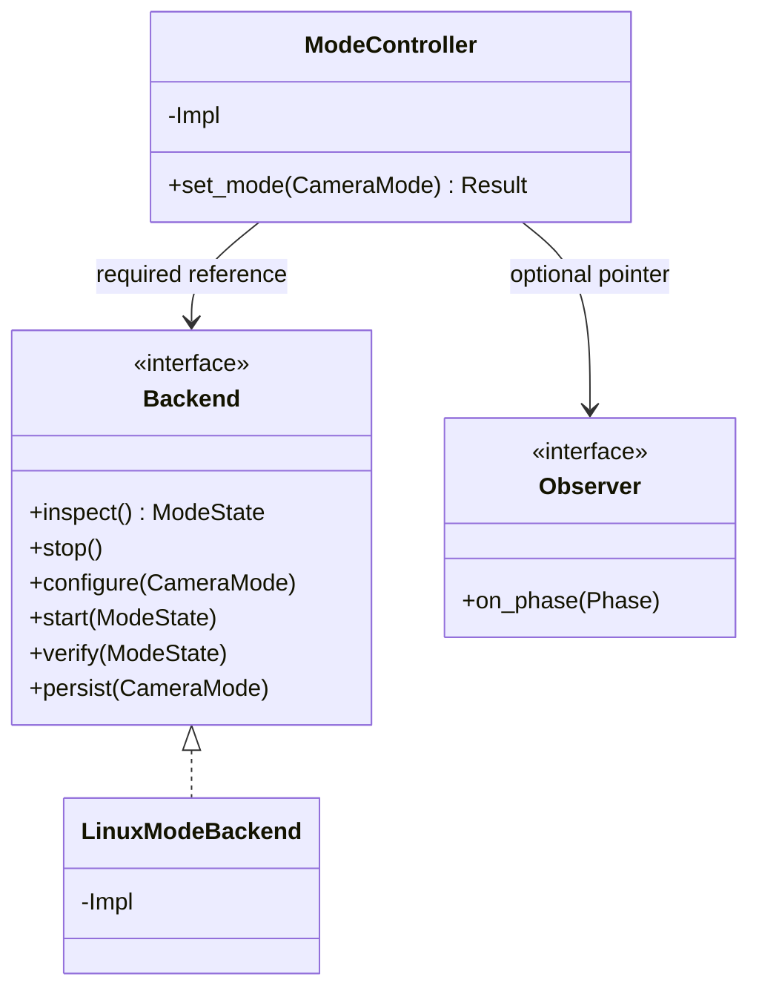
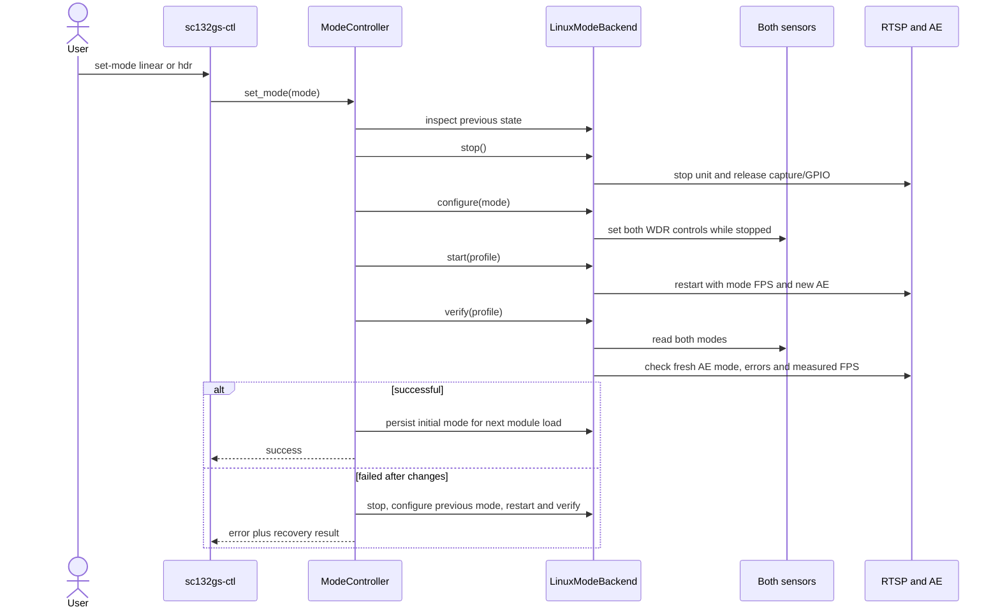

# Dual-camera HDR / Linear mode switching

Both modes use the existing two-lane Device Tree, 1088 x 1280 RGGB RAW10 per
eye, and the same stereo RTSP URL. Default profiles are HDR 30 FPS and Linear
60 FPS. A switch interrupts the RTSP session; a player may need to reconnect.

HDR now uses unity analogue gain and a managed TOTAL/SECOND ratio of 256.
AE adjusts TOTAL; the driver updates TOTAL, SECOND and HDRC coefficient in
one grouped transaction per sensor. RTSP restores midtones using a RAW10
display curve calibrated for this profile. See [HDR ratio and RAW comparison](HDR_RATIO.md)
for legacy/private control units, measured highlights and validation limits.

```sh
sc132gs-ctl mode
sudo sc132gs-ctl set-mode linear
sudo sc132gs-ctl set-mode hdr
sudo sc132gs-ctl status
```

The `hdr` module parameter is now only the initial mode. Runtime state comes
from each sensor's `wide_dynamic_range` V4L2 control, not that module parameter.
The driver rejects a mode change while that sensor is streaming. STREAMON
resets/reapplies the complete mode table and verifies critical registers.
In Linear mode, `3018=32` and `3019=0c` select two lanes, while the original
linear PLL, RAW10 format and line timing remain in use. HDR retains `3225=00`.

## Ownership and failure handling

`ModeController` has a C++20 move-only PIMPL API. It receives a required Backend
reference and an optional Observer pointer. Its synchronous Result carries
the primary error separately from any recovery error. Observer callbacks
report phases only; they do not replace the final Result.

`LinuxModeBackend` owns a process lock, descriptors and captured stream settings.
It discovers sensor subdevices from media topology using I2C address identity;
it does not assume `/dev/videoN` or subdevice numbers remain fixed. Platform
processes execute argument vectors, without a shell. The controller does not
unload CAMSS, rewrite a DTB, or unload the sensor module during a mode switch.
On this board CAMSS autoload is blacklisted; the writable controller loads it
before graph discovery when needed after reboot. It never unloads it.
The VPU driver can retain closed firmware sessions. After stopping the stream,
the backend discovers codec nodes by sysfs driver identity and checks for
external users before reloading `iris_vpu`. External users produce `busy`;
the controller does not terminate them. This resets the codec only, preserving
the CAMSS and sensor modules. RTSP reconnects reuse one persistent hardware
encoder owned by the capture service, independent of client media lifetimes.





The target brightness, bind address, port and downscale are retained. The new
common preferences are also saved in `/etc/sc132gs-stereo.env` so a switch
after reboot can recreate the previous LAN stream even when the unit is absent.
The new AE object uses the selected mode's exposure bounds; exposure values are reset
to the mode's default rather than copying numbers with different units.
An existing auto-off state is applied before any captured frame enters AE,
so changing modes does not temporarily enable automatic adjustment.
A positive Linear exposure-time limit is not carried into HDR, whose physical
time conversion remains uncharacterized. HDR uses the vendor exposure control.

Only after both modes and the measured capture rate agree is the `hdr=` value
atomically updated in `/etc/modprobe.d/sc132gs-external-trigger.conf`. That
selects the initial mode on the next driver load. The existing RTSP unit remains
transient and is not automatically started after a reboot. The legacy unit
name `sc132gs-hdr-rtsp.service` currently serves either mode.

Changing to the already active default profile checks readiness without
restarting the stream. A concurrent switch is rejected by the process lock.
Failures after a partial camera update restore both eyes before reopening the
stream. A recovery failure is reported separately, never as a successful switch.

## Validation

The platform-independent recovery test covers partial second-eye failure,
verification timeout, persistence failure, recovery failure, idempotence and
auto-off preservation. All four CTest cases passed on the board: mode recovery,
Bayer reconstruction, RAW10 conversion and stereo NV12 composition.

Hardware checks used the installed final driver on kernel 6.8.0-1084-qcom:

| Check | Linear | HDR |
| --- | --- | --- |
| Contiguous paired captures | 300 at 59.99 FPS | 300 at 30.13 FPS |
| Maximum receiver timestamp difference | 270 us | 304 us |
| Full RAW frames per eye | 3 distinct, 1,740,800 bytes each | 3 distinct, 1,740,800 bytes each |
| Streaming WDR write rejected | yes | yes |
| Concurrent controller rejected | yes | yes |

Both modes had the same live FDT hash within one boot. The two-lane HDR
readback was `3018/3019=32/0c`, `3220=c3`, `3222=32`, `3225=00` on both eyes.
Linear RTSP/RTP measured 60.10 access units per second on Windows. Its fresh
2176x1280 software-decoded image had both complete eyes; the board software
decoder reached only about 42 FPS while capture/encoding were also running.
That decode measurement does not demonstrate a 60 FPS viewer.

The fresh HDR decoder produced 293 distinct 2176x1280 frames in about
9.64 seconds. Visual inspection did not show the previous fixed lower-fifth
grid boundary. AE target brightness and auto-off were retained across both
switches. Repeating the current profile preserved the unit's MainPID.
A deliberately invalid persistence value caused a late switch failure;
the controller restored both eyes to HDR, restarted at 30 FPS, and reported
`reason=persistence restored=1`. The test restored the configuration file.

Reboot verification confirmed initial Linear mode (`hdr=N`) on both sensors;
the controller then started the existing LAN stream from saved common settings.
The initial mode-switch validation ended in HDR 30 FPS with AE target 40.
The subsequent persistent-encoder repair validation ended in Linear 60 FPS
with the same target. Query `sc132gs-ctl mode` for current runtime state. Evidence is in
[`mode-switch-evidence-20261006/`](mode-switch-evidence-20261006/).

## Deployment and recovery

Build the module and CLI with `make module sc132gs-ctl`. Deploy the controller,
startup script and rebuilt RTSP binary together: the script now passes
`--auto-exposure on|off` to the server. Install the module to the board's
`extra/sc132gs.ko`, run `depmod -a`, and reboot for the initial driver update.
Subsequent mode switches use writable WDR controls and do not require reboot.

The board backup directory is `/home/ubuntu/sc132gs-mode-switch-20261006/`:
`sc132gs-before.ko`, `ctl-before`, `run-before.sh`, and `modprobe-before.conf`.
Those backups restore the previous fixed-HDR driver/controller/script; they
do not change the common two-lane Device Tree. Stop the RTSP unit before
restoring them, then run `depmod -a` and reboot before restarting capture.
