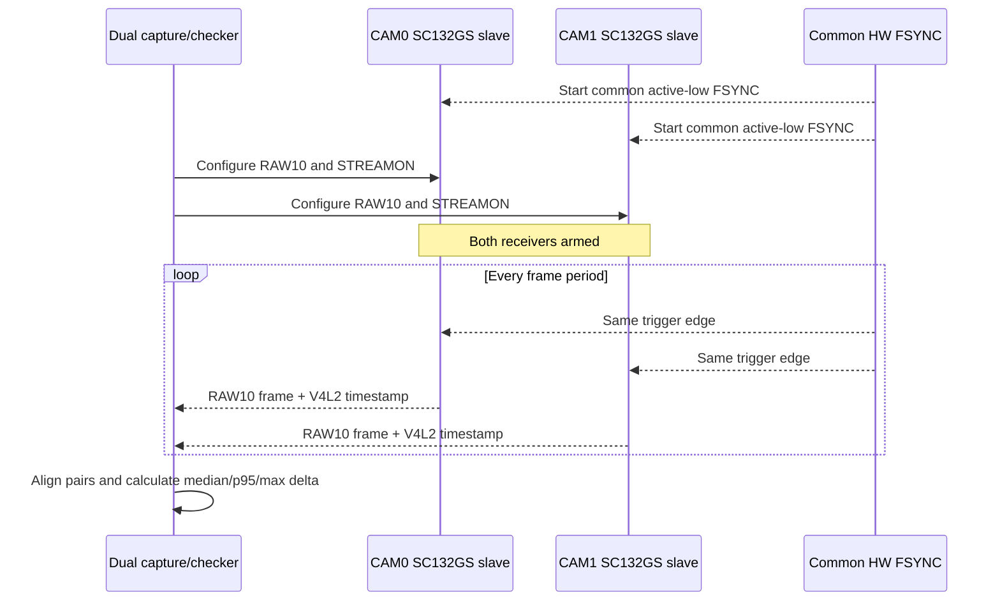

# SC132GS standard V4L2 first probe on RUBIK Pi 3

## Sensor power and controls (2026-10-01 source update)

The driver now uses runtime PM to enable xclk/reset during sensor access and
release xclk after stream-off. It retains the existing trigger-mode reset
behavior. `exposure` and `analogue_gain` remain writable while streaming;
their cached values are restored after each mode-table write. New controls:

- `V4L2_CID_VBLANK` (`vertical_blanking` in `v4l2-ctl`) is writable in
  free-run mode (120..64255 lines). Frame length is
  1280 + vblank, and the exposure maximum follows frame length minus 6 lines.
  In external-trigger mode it is inactive/read-only because FSYNC and the
  existing `trigger_60fps` override own frame timing.
- `test_pattern` offers Disabled and four vertical bar variants. It is
  restored on every stream-on, including after runtime suspend.

The updated module compiled against the board's `6.8.0-1084-qcom` headers
and was installed on 2026-10-01. The prior module is backed up on the board
as `/lib/modules/6.8.0-1084-qcom/extra/sc132gs.ko.pre-pm-20261001`.
After reboot, both sensors registered and showed `suspended` at rest,
`active` while streaming, and `suspended` again after stopping. Two capture
sessions ran at about 59.9 FPS. A separate 30-pair FSYNC check passed with
no index offset and 330 us maximum receiver timestamp difference. Enabling
CAM0 test pattern changed its sampled RAW brightness from 8% to 3% while
CAM1 stayed at 8%; disabling it restored CAM0 to 8%. Setting the pattern
while suspended was applied on the next stream. The free-run vblank control
has compile and range checks only: the installed DT selects external FSYNC,
where vblank is intentionally inactive.

## Live automatic exposure CLI (2026-10-01)

The SC132GS V4L2 subdevices now expose standard writable exposure
(sensor lines, 8..2560) and analogue_gain (vendor LUT index, 0..128)
controls. The RAW10 capture program owns the automatic loop; the kernel
driver only applies validated sensor settings. There is no /proc control
node.

Start the paired RAW10 capture and common 60 Hz FSYNC on the board, then set
the target brightness:

~~~sh
sudo sc132gs-ae-session start
sudo sc132gs-ctl set-brightness 40
sudo sc132gs-ctl status
sudo sc132gs-ctl max-exposure-us 8000  # optional motion-blur ceiling
sudo sc132gs-ctl max-exposure-us 0     # remove the optional ceiling
sudo sc132gs-ctl auto off              # hold the current sensor settings
sudo sc132gs-ae-session stop
~~~

set-brightness accepts 1..90. It turns on automatic adjustment. The number
is a 0..100 scale based on the median of sampled, original 10-bit RAW pixels
in the central 80% of the image. It is not lux or the Windows viewer's
per-frame contrast stretch. The reported CAM0 and CAM1 percentages are
measured independently; one common exposure and gain setting is applied to
both sensors for stereo consistency.

The automatic loop raises exposure first, up to 95% of the observed frame
period (or an explicit max-exposure-us limit), then raises analogue gain.
When the scene brightens it lowers gain first, then exposure. After a limit
or target change, it gradually trades surplus gain back for exposure. It
never changes frame timing to gain brightness. brightness_limited=1 means
the requested brightness is outside the currently reachable range.
error_errno reports an I/O failure, after which automatic control stops.

The session command starts transient systemd units; it does not install a
boot-time service. sc132gs-ctl needs an active paired capture and root
access to its local control socket. The existing Windows viewer also starts
sc132gs-paired-stream, so use either that viewer or
sc132gs-ae-session start as the capture owner, not both at once. With the
viewer active, sudo sc132gs-ctl controls its capture process.

For driver diagnostics, stop automatic adjustment before writing the
standard V4L2 controls directly:

~~~sh
sudo sc132gs-ctl auto off
v4l2-ctl -d /dev/v4l-subdev27 --list-ctrls
sudo v4l2-ctl -d /dev/v4l-subdev27 --set-ctrl=exposure=800,analogue_gain=62
~~~

The subdevice number may change after reboot; identify CAM0 by the
sc132gs *-0032 media entity and CAM1 by sc132gs *-0030.

Capture node numbers can change too. Install `sc132gs-discover.py` as
`/usr/local/sbin/sc132gs-discover` before running the pipeline setup or the
live viewer. It follows enabled media links from each sensor entity to its
video interface and rejects missing or ambiguous paths:

```sh
sudo install -m 755 sc132gs-discover.py /usr/local/sbin/sc132gs-discover
sc132gs-discover pair
```

CAM0 remains the sensor at I2C address `0x32`; CAM1 remains `0x30`.
The printed `/dev/videoN` values are runtime endpoints, never camera IDs.

Hardware check on 2026-10-01: both controls were accepted and read back on
both sensors while streaming. With the 60 Hz trigger override active, the
capture program measured about 60 FPS. Target 40 produced CAM0/CAM1 RAW
brightness of about 35%/43% at 1329 exposure lines and gain index 68; both
sensors reported the same settings. Limiting exposure to 1000 us while
requesting 90% brightness reached gain index 128 and reported
brightness_limited=1. These figures describe the scene present during
the test; they are not a calibration target for other lighting.

完整的繁體中文新手教學、故障排除、參考資料、板端修改與產出檔案清冊，請見
[`SC132GS_QCS6490_CAMERA_BRINGUP_TUTORIAL.zh-TW.md`](SC132GS_QCS6490_CAMERA_BRINGUP_TUTORIAL.zh-TW.md)。

This is a fixed-mode RAW10 V4L2 driver for Ubuntu kernel
`6.8.0-1084-qcom`. The verified target mode is one free-running SC132GS at
1088x1280, 60 fps, RAW10 over one CSI-2 data lane at 1200 Mbps.

## Verified hardware result (2026-09-30)

- SC132GS chip ID: `0x0132` on CCI1 master 0, address `0x32`.
- Media path: `sc132gs -> msm_csiphy1 -> msm_csid0 -> msm_vfe0_rdi0 -> /dev/video0`.
- V4L2 format: `pRAA`, 1088x1280, 1360-byte stride, 1,740,800 bytes/frame.
- Three consecutive external-sensor frames were captured successfully and had
  distinct SHA-256 hashes:
  - `cc2834772e7c08d356daf029887d75634220e16cb6f9c94e6ef9dd2568f7f3f4`
  - `60c42c589c350d24d3eb3e1a9037beca90d769bc4186383b2811b50af018a6d5`
  - `fc3c88cdd30d1f8e9759e961adb7d78e53b52350bf1184ec1d1d5fc07d0c84a5`
- CSID0 and VFE0 interrupt counts increased during capture. The driver verified
  13 critical mode registers and confirmed stream-on register `0x0100=0x01`.

On the board, capture three frames with:

```sh
sudo capture-sc132gs-raw /tmp/sc132gs.raw 3
```

Verified target facts before this source was created:

- standard `qcom-camss` and `i2c-qcom-cci` modules are installed;
- their `qcom,sc7280-*` device-tree nodes exist but are disabled;
- vendor `camera_qcm6490` owns the camera hardware in the normal boot;
- slot 0 probes SC132GS ID `0x0132` at CCI1 master 0, address `0x32`;
- slot 0 maps to CSIPHY1 and reset GPIO57.

Remaining characterization work (not required for the verified RAW capture):

- the source Bayer order is declared RGGB;
- the public D-Robotics receiver configuration uses clock lane `<7>` and one
  data lane `<0>` at 1200 Mbps total (600 MHz CSI-2 DDR link frequency);
- lane polarity remains unverified from the complete GS130WI-to-RUBIK routing;
- Bayer order is declared RGGB and should be checked against a known optical
  target before color-processing use (the GS130WI module is monochrome).

The deployed `dtb_a` remains a complete 64 MiB Canonical FAT16 image with only
RUBIK Pi entry 12 replaced. Keep the known-good official image for fastboot
recovery. Do not unload `qcom_camss` on this Ubuntu kernel; its hot-unplug path
is unsafe. Reboot instead when a clean CAMSS state is required.

## Stereo external-trigger mode

Free-running capture proves both CSI paths, but it does not synchronize the two
exposures. Controlled low/high tests on the assembled hardware established the
actual control routing: TLMM57/TLMM58 are sensor RESET (a low level immediately
removes CCI acknowledgement), while TLMM18/TLMM19 carry the two FSYNC inputs.
FSYNC is idle-high and uses a 100 us active-low pulse at 30 Hz.

The driver keeps free-run as the default. External-trigger slave mode can be
selected either with the read-only module parameter:

```sh
sudo modprobe sc132gs external_trigger=1
```

or per sensor with `smartsens,external-trigger`. The ready-to-build DT version
is `sc132gs-rubikpi3-dual-sync-overlay.dts`; it keeps TLMM57/58 as RESET and
disables the unused fixed-regulator ownership of TLMM18/19. Both FSYNC pins are
requested together and changed by one GPIO-v2 ioctl; two independent userspace
GPIO loops are not synchronization.



After `configure-sc132gs-dual-pipeline.sh`, build and run the complete GPIO and
timestamp test as root:

```sh
make tools
sudo ./run-sc132gs-sync-test.sh
```

The Windows live viewer now uses `sc132gs-paired-stream`: the board pairs CAM0
and CAM1 by V4L2 receiver timestamp before preview decimation, sends each pair
through one framed SSH stream, and the UI composites both images into one bitmap
for a single paint.  The status bar reports both sequences and the timestamp
delta for the displayed pair.

`prepare-sc132gs-sync-gpios` first verifies that `camera1_vio_ldo` and
`camera2_vio_ldo` are disabled with zero users before releasing their GPIO
ownership. The checker discards eight startup frames and applies a 500 us P95
receiver-timestamp threshold. The final cold-boot run on 2026-10-01 captured
sequence ranges `8..307` on both cameras. Because the two STREAMON calls are
sequential while FSYNC is already running, Camera0 began four triggers earlier;
timestamp alignment produced 296 stable pairs with median 271 us, P95 285 us,
maximum 298 us, and signed drift 10 us. This proves stable common-trigger
capture through both V4L2 paths. A logic-analyzer measurement of both
FSYNC/exposure signals remains the strongest electrical proof of exposure-start
skew.
