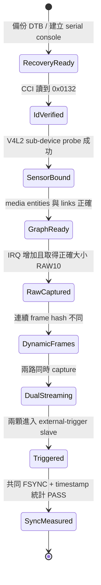
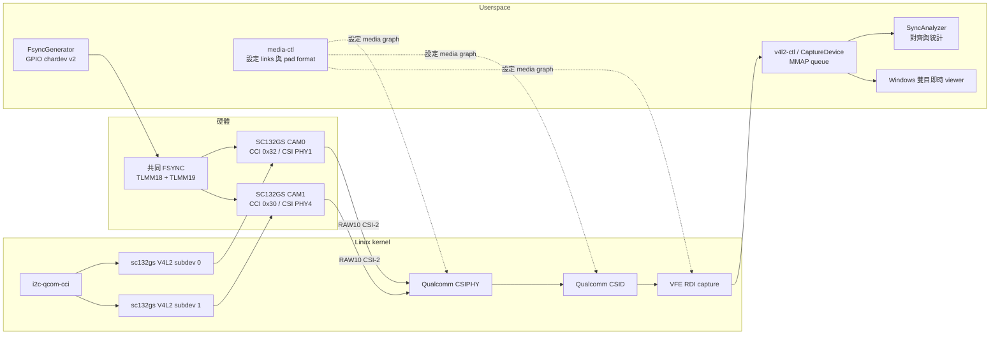
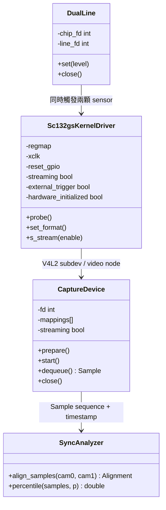
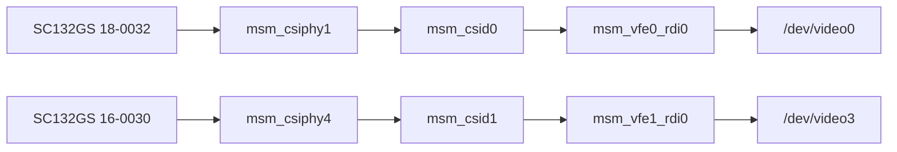
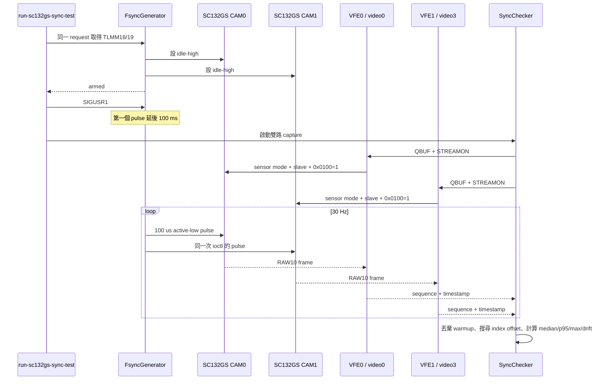

# QCS6490 + 雙 SC132GS Camera Bring-up：從完全不支援到 V4L2 RAW10 與共同 FSYNC

> 實作平台：RUBIK Pi 3 V02 / Qualcomm QCS6490（Linux 相容字串為 QCM6490/SC7280）  
> 作業系統：Ubuntu 24.04，kernel `6.8.0-1084-qcom`  
> 感測器模組：GS130WI，影像感測器為 SmartSens SC132GS  
> 本文件狀態：2026-10-01，已在實機完成雙路 RAW10、即時預覽與共同外部觸發驗證

這不是一份「照抄指令就保證能在任何 BSP 工作」的文件。Camera bring-up 同時跨越硬體接線、供電與時鐘、CCI/I²C 控制、MIPI CSI-2 傳輸、Device Tree、kernel sensor sub-device、Qualcomm CAMSS、Media Controller、V4L2 buffer 與同步量測。最有效率的方法是把每一層拆成獨立驗證關卡，上一層沒有證據就不進下一層。

閱讀方式：第一次移植請依第 2～14 節順序執行；遇到既有故障先查第 13 節；需要交接、備份或清理系統時看第 15～16 節；第 17 節是後續學習與原始資料入口。

---

## 1. 最終結果與仍未證明的部分

### 1.1 已完成的實機結果

| 項目 | Camera 0 | Camera 1 |
|---|---|---|
| CCI / I²C 位址 | CCI1 master 0 / `0x32` | CCI0 master 0 / `0x30` |
| Chip ID | `0x0132` | `0x0132` |
| CSI PHY | CSIPHY1 | CSIPHY4 |
| CSID / VFE | CSID0 / VFE0 RDI0 | CSID1 / VFE1 RDI0 |
| V4L2 node（本次開機） | `/dev/video0` | `/dev/video3` |
| RESET | TLMM57 | TLMM58 |
| FSYNC | TLMM18 | TLMM19 |

共同影像格式：

- `1088 × 1280`
- `SRGGB10_1X10` media-bus code
- V4L2 fourcc `pRAA`（packed RAW10）
- 一條 CSI-2 data lane，lane bit rate 約 `1.2 Gbit/s`
- `link-frequencies = 600 MHz`，它是 DDR clock，所以 lane bit rate 是其兩倍
- 每行 `1088 × 10 / 8 = 1360 bytes`
- 每幀 `1360 × 1280 = 1,740,800 bytes`

三個連續外部感測器 frame 的 SHA-256 均不同：

```text
cc2834772e7c08d356daf029887d75634220e16cb6f9c94e6ef9dd2568f7f3f4
60c42c589c350d24d3eb3e1a9037beca90d769bc4186383b2811b50af018a6d5
fc3c88cdd30d1f8e9759e961adb7d78e53b52350bf1184ec1d1d5fc07d0c84a5
```

冷開機後的最終共同觸發測試：

```text
warmup_frames=8 cam0_sequence=8..307 cam1_sequence=8..307
paired_frames=296 cam1_index_offset=-4
abs_delta_us median=271 p95=285 max=298 worst_pair=26 signed_drift=10
timestamp_check=PASS threshold_us=500
```

FSYNC generator 同次測試輸出：

```text
FSYNC generator armed chip=/dev/gpiochip4 lines=18,19 fps=30 pulse_us=100 polarity=active-low
FSYNC generator started
FSYNC generator stopped pulses=319
```

### 1.2 證據邊界

這次結果證明：

- 兩顆 SC132GS 都能由 Linux V4L2 sensor driver 控制。
- 兩條 CSI-2 → CAMSS → VFE RDI → V4L2 capture path 都能輸出變動的 RAW10。
- 兩顆 sensor 在共同 active-low FSYNC 下穩定輸出。
- 兩路 V4L2 receiver timestamp 的 P95 差值小於 `500 µs`。

這次結果**沒有直接證明**：

- 兩顆 sensor 的真正 exposure-start 電氣偏差只有 `285 µs`。V4L2 timestamp 是 receiver/buffer 路徑上的時間，不是 sensor 曝光腳位量測。
- Bayer color order 已由彩色標靶校正。GS130WI 模組為單色，這裡的 `SRGGB10` 主要是傳輸格式宣告。
- userspace GPIO pulse generator 具硬即時保證。它適合 bring-up；量產品應考慮硬體 timer/PWM、專用同步器或 RT domain。

要證明真正 exposure skew，應同時用邏輯分析儀或示波器量兩路 FSYNC 與兩顆 sensor 的 exposure/frame-valid 訊號。

---

## 2. 第一性原理：為什麼「讀得到 Camera ID」仍然沒有影像？

Camera 有兩條本質不同的路：

1. **控制路徑**：CPU 透過 CCI/I²C 讀寫 sensor register。
2. **資料路徑**：sensor 透過 MIPI CSI-2 高速差分線送出 RAW pixel stream。

讀到 `0x0132` 只證明控制路徑大致成立：sensor 有供電、沒有一直被 RESET、MCLK/CCI 足以回應。它完全不能證明 lane mapping、link frequency、CSI PHY、CSID virtual channel/data type、VFE routing 或 userspace buffer 正確。



實務上每一關要回答不同問題：

| 關卡 | 最小證據 | 尚不能宣稱 |
|---|---|---|
| Hardware presence | CCI ACK + chip ID | MIPI 有資料 |
| Driver binding | 兩個 `sc132gs` media entity | pipeline 可串流 |
| Graph routing | sensor 到 VFE RDI 的 link enabled | frame 正確 |
| RAW capture | 正確 bytes/frame、CSI/VFE IRQ 增加 | 畫面內容正確 |
| Dynamic frame | 連續 frame hash 不同 | 雙目同步 |
| Dual stream | 兩路同時持續輸出 | 曝光同時開始 |
| FSYNC test | 共同 pulse、穩定配對、timestamp 統計 | 電氣 exposure skew |

---

## 3. 分層架構與 ownership

### 3.1 資料流 UML



### 3.2 軟體角色 UML



設計責任如下：

- `sc132gs.c` 只擁有 sensor 的 register、xclk、RESET、stream state 與 sub-device API；它不驅動共同 FSYNC，避免兩個 sensor instance 各自切 GPIO 而產生 skew。
- Device Tree 描述不可由 driver 猜測的板級相依：CCI bus、I²C address、clock、RESET、CSI endpoint、lane 與 link frequency。
- `qcom_camss` 擁有 SoC receiver：CSIPHY、CSID、VFE。
- `media-ctl` 組出 pipeline；`/dev/videoN` 是 VFE output，不是 sensor 本身。
- `DualLine` 用一次 GPIO v2 line request 擁有兩條 FSYNC，單次 ioctl 同時更新兩條線。
- `CaptureDevice` 以 RAII 擁有 fd/MMAP/STREAMON 狀態；發生錯誤時 destructor 會 STREAMOFF、munmap、close。
- 同步分析與硬體 I/O 分離，讓 alignment/percentile 可以用假資料單元測試。

目前工具直接提供 CLI，對外邊界是 C++20；kernel driver 依 Linux kernel C API。若要產品化成 library，建議保留小型 `IFsyncSource`、`ICaptureObserver` 與結構化 `CameraError`，不要把 ioctl、GPIO path 或 `/dev/videoN` 洩漏到上層。

---

## 4. Bring-up 前置準備

### 4.1 安全規則

1. **關機後才插拔 MIPI FPC**。帶電插拔可能損壞 sensor 或 SoC PHY。
2. 修改 DTB/boot partition 前先建立可校驗備份，且準備 serial console 與 fastboot recovery。
3. 一次只改一個變因：I²C address、RESET、clock、lane mapping、sensor register 不要一起亂換。
4. 不要在這個 Ubuntu kernel 上 hot-unload `qcom_camss`；實測它的 hot-unplug path 不安全。需要乾淨狀態就 reboot。
5. 不要把其他 sensor 的 binary、XML 或 CHI module 改名冒充 SC132GS。

### 4.2 板端工具

```bash
sudo apt update
sudo apt install v4l-utils device-tree-compiler build-essential g++ python3
sudo apt install linux-headers-$(uname -r)
```

確認 kernel 與 headers 完全一致：

```bash
uname -r
test -e /lib/modules/$(uname -r)/build
```

本次目標必須是 `6.8.0-1084-qcom`。不同 kernel ABI 需要重編 `sc132gs.ko`，不能直接搬用。

### 4.3 建立獨立 serial console

SSH 在 boot failure 時不可用，所以 serial console 是 DTB 實驗的必要條件。Windows PowerShell 中，含空白的 Python 路徑必須完整引用：

```powershell
& 'D:\Program Files\Python312\python.exe' -m serial.tools.miniterm COM5 115200
```

本次共享 console 曾經無法看到即時輸出，最後以獨立 PowerShell terminal 解決。若 COM port 或 Python 路徑不同，先用裝置管理員與 `Get-Command python` 確認，不要照抄 `COM5`。

### 4.4 建立 boot recovery

本機保留：

- 官方 known-good `dtb_a` image。
- 修改前完整 64 MiB `dtb_a` 備份。
- SHA-256 清單。
- Android platform-tools / `fastboot.exe`。
- Windows WinUSB driver 安裝工具。

板端原始備份：

```text
/var/backups/sc132gs-v4l2-20260930-dtb-a/dtb_a.img
SHA-256: ddd98b0497d708a26b2ed5b35e1423302159b908ef9d61029f6715d42032945f
大小: 67,108,864 bytes
```

`/dev/sde2` 是**這台板子本次開機**的 `dtb_a`，不是跨裝置保證。任何 restore/flash 前都要重新以 `lsblk -o NAME,PATH,SIZE,FSTYPE,PARTLABEL` 確認 `PARTLABEL=dtb_a` 和 64 MiB 大小。

---

## 5. Phase A：先證明硬體控制路徑

### 5.1 盤點現有 camera stack

先不要寫 driver，先看誰擁有硬體：

```bash
uname -a
lsmod | grep -E 'camera|camss|cci'
ls -l /dev/media* /dev/video* /dev/v4l-subdev* 2>/dev/null
dmesg | grep -Ei 'camera|camx|camss|cci|csiphy|sensor'
```

這塊 BSP 的 normal camera 路徑原本由 Qualcomm vendor module `camera_qcm6490` / CamX 使用；upstream-style `qcom_camss` 與 vendor stack 不能同時擁有同一組 CCI/CAMSS 資源。

### 5.2 讀 chip ID

本次先用 QCM6490 camera UAPI probe，在暫停 `cam-server`、釋放 vendor camera session 後讀 sensor ID，結果為：

```text
CAM0: /dev/v4l-subdev7, CCI address 0x32, kernel shifted address 0x64, ID 0x0132
CAM1: /dev/v4l-subdev8, CCI address 0x30, kernel shifted address 0x60, ID 0x0132
```

反向交換位址會 NACK，因此兩個 connector 的控制路徑已被獨立識別。

注意 Linux 不同 I²C API 有時使用 7-bit address，有時 log 顯示左移一位的 8-bit address。`0x32 ↔ 0x64`、`0x30 ↔ 0x60` 是表示法差異，不是四顆裝置。

### 5.3 此階段的結論

可以宣稱：

- 兩顆 sensor 有回應。
- 位址、基本電源、RESET 與 CCI routing 可用。

不能宣稱：

- MIPI lane 正確。
- sensor 已 stream on。
- CSIPHY/CSID 收到 frame。
- `/dev/videoN` 能取得影像。

---

## 6. Phase B：先嘗試 CamX，確認真正 blocker，再決定轉 V4L2

### 6.1 CamX 實際狀況

已安裝並確認：

- `qcom-camxapi-qcm6490-dev 1.0.6+repack2`
- `cam-server`
- QMMF 與 GStreamer `qtiqmmfsrc`
- `gstreamer1.0-plugins-qcom-qmmfsrc`

其中一次 apt 安裝失敗是 DNS：

```text
Temporary failure resolving ppa.launchpadcontent.net
```

這是網路/套件來源問題，不是 camera driver 問題；DNS 恢復後套件可安裝。

### 6.2 為什麼 `cam-server` 顯示 0 cameras？

CamX plugin 本身能載入，但：

```text
Number of cameras: 0
```

板上 CamX 要求的 sensor module metadata parser 是：

```text
Parameter Parser V5.5.1, build 2411131018
```

公開可找到的 SC132GS material 是另一套平台/舊版格式，沒有能直接給 QCM6490 CamX V5.5.1 載入的 SC132GS CHI sensor module binary。因此這是**sensor integration artifact 缺失**，不是單純 XML 中填錯 camera ID。

不採用的捷徑：

- 把 OV9282 binary 改名成 SC132GS。
- 修改 V2 binary header 冒充 V5.5.1。
- 只補一個 `.xml` 就期待 CamX enumeration。

這些做法會破壞 ABI/metadata 語意，即使勉強載入也不代表 mode table、exposure/gain、CSI timing 或 EEPROM schema 正確。

### 6.3 架構決策

本案目標先是「拿到可驗證的 RAW image」，不是立即取得完整 Qualcomm ISP/3A。故改走：

```text
SC132GS V4L2 sub-device
        ↓
upstream qcom_camss Media Controller
        ↓
VFE RDI RAW capture node
```

代價是：

- 先只有固定 mode RAW10。
- 沒有 CamX ISP、AE/AWB/AF 與 QMMF 整合。
- userspace 必須配置 media graph。

好處是每層可見、可量測、可使用標準 Linux API，適合首次 bring-up。

---

## 7. Phase C：讓 `qcom_camss` 取得硬體 ownership

### 7.1 排除 vendor driver 資源衝突

板端建立：

```text
/etc/modprobe.d/blacklist-camera-qcm6490.conf
```

內容：

```conf
blacklist camera_qcm6490
install camera_qcm6490 /bin/false
```

目的不是刪除 CamX，而是避免 `camera_qcm6490` 在 V4L2 probe boot 中先 claim 同一組 CCI/CAMSS resource。

### 7.2 Device Tree 必須描述的事

雙目 overlay `sc132gs-rubikpi3-dual-overlay.dts` 描述：

- `cci0`、`cci1` enabled。
- CAM0：`camera@32`、xclk、TLMM57 RESET、CSIPHY1 endpoint。
- CAM1：`camera@30`、xclk、TLMM58 RESET、CSIPHY4 endpoint。
- CAMSS enabled，補齊 clock/power-domain/supply 名稱。
- 每個 endpoint 使用 clock lane 7、data lane 0、link frequency 600 MHz。

雙目同步 overlay `sc132gs-rubikpi3-dual-sync-overlay.dts` 另做兩件事：

- 將兩顆 sensor 標成 `smartsens,external-trigger`。
- 停用原本占用 TLMM18/19 的兩個 fixed GPIO regulator，讓共同 FSYNC source 能取得 GPIO ownership。

`smartsens,external-trigger` 是這次 bring-up 的私有 DT property，尚未成為 upstream binding。產品化時要補 YAML binding 或改用正式的同步控制架構。

### 7.3 不要把 `/dev/videoN` 當硬體接頭編號

`/dev/video0` 不是「Camera Connector 0」的固有名稱。它只是本次註冊順序下的 VFE output node，重開機或 driver 改版可能變動。Bring-up 可以先固定；產品程式應由 `/dev/mediaN` topology 的 entity name 找到對應 video interface，再建立穩定 mapping。

---

## 8. Phase D：撰寫最小固定模式 SC132GS V4L2 sensor driver

### 8.1 最小 driver 的責任

`sc132gs.c` 只做：

- 16-bit register address / 8-bit value 的 regmap。
- xclk 與 RESET 管理。
- 讀 `0x3107/0x3108`，驗證 chip ID `0x0132`。
- 註冊一個 fixed `1088×1280 RAW10` source pad。
- 提供唯讀 `V4L2_CID_LINK_FREQ` 與 `V4L2_CID_PIXEL_RATE`。
- 提供 exposure、analogue gain、free-run vblank 與 test pattern controls；外部觸發模式的 vblank 標為不可用。
- 以 runtime PM 管理串流期間的 xclk 與 RESET，控制值在每次寫入 mode table 後恢復。
- stream-on 時寫 mode table、讀回關鍵 register，再寫 `0x0100=0x01`。
- stream-off 時寫 `0x0100=0x00`。
- 以 mutex 序列化 stream state。

它刻意不先做：

- 多解析度、多 FPS mode selection。
- 多電源 rail 與 system suspend/resume 的完整產品化流程。
- ISP tuning 或 Bayer/color pipeline。
- kernel 內 hardware sync controller。

這是縮小問題面的關鍵：先讓一個已知 mode 穩定出 RAW，再擴張 API。

### 8.2 Build 與安裝

在與 target kernel 相同的板上：

```bash
cd sc132gs_v4l2_probe
make module
sudo install -D -m 0644 sc132gs.ko \
  /lib/modules/$(uname -r)/extra/sc132gs.ko
sudo depmod -a
modinfo sc132gs
```

目前板端 module：

```text
/lib/modules/6.8.0-1084-qcom/extra/sc132gs.ko
SHA-256: c22706e71e1a1f9b89b33148ad5bba84fb25f5449c46fb81c2bf5949386da79b
```

保留的上一版：

```text
sc132gs.ko.pre-600mhz
sc132gs.ko.pre-sync-f2089410
```

### 8.3 Driver probe 檢查

```bash
sudo modprobe sc132gs
dmesg | grep -E 'sc132gs|chip id|registered fixed'
```

預期每顆都看到：

```text
SC132GS chip id 0x0132
registered fixed 1088x1280 RAW10 mode, link frequency 600000000 Hz
```

如果只有一顆，先查 address/RESET/clock，不要先改 MIPI format。

---

## 9. Phase E：DTB 開機策略與曾經發生的 boot failure

### 9.1 失敗過的方式

曾建立兩個非預設 GRUB entry：

- `Ubuntu CAMSS host-only probe`
- `Ubuntu SC132GS V4L2 probe`

並由 `/boot/dtb/sc132gs/*.dtb` 使用 GRUB `devicetree` 載入。一次自訂 boot 在 UEFI 階段失敗，曾看到：

```text
EFI stub: Booting Linux Kernel...
alloc magic is broken
Aborted
unhandled synchronous exception
```

另一次直接進入 `grub>`；當時系統 root 為 `(hd6,gpt3)`，EFI config 在 `(hd6,gpt1)`。

不能只憑這段 log 認定是 SC132GS driver crash，因為 kernel 尚未真正執行 sensor probe。較合理的邊界是：自訂 GRUB/DTB 載入或映像包裝路徑存在相容性問題。

### 9.2 最後採用的方式

保留 Canonical 原本完整 64 MiB FAT16 `dtb_a` image，只替換 concatenated DTB 中 RUBIK Pi 對應的 entry 12；其他 board entry 維持 byte-identical。工具：

- `index-concatenated-dtbs.py`：找出 container 裡每個 FDT entry。
- `replace-concatenated-dtb.py`：只替換指定 entry，並驗證未修改 entry 的 hash。
- `restore-original-dtb-a.sh`：先核對備份 hash，再還原整個 partition 並讀回驗證。

這種方法仍屬 BSP/boot-chain 特定操作，不是通用 Linux DT overlay 流程。新板或新 image 必須重新辨識 entry，不能永遠假設 index 12。

### 9.3 Boot failure 的回復順序

1. serial console 保持開啟。
2. 若可進 GRUB，先選原本 Ubuntu entry，不要繼續測新 DTB。
3. 若 `dtb_a` 已無法開機，進 fastboot/EDL recovery。
4. Windows 確認 WinUSB 與 `fastboot devices`。
5. 重新以 partition table 確認目標確實是 `dtb_a`。
6. flash known-good 64 MiB image，完成後重新上電。
7. SSH 恢復後先比對 `/proc/device-tree/model` 與 boot log，再做下一次修改。

---

## 10. Phase F：Media Controller graph 與單路 RAW10

### 10.1 找到正確 media device

```bash
for m in /dev/media*; do
  echo "=== $m ==="
  media-ctl -d "$m" -p | head -20
done
```

本次 CAMSS graph 是 `/dev/media1`，但編號不是 ABI。預期 sensor entity：

```text
sc132gs 18-0032
sc132gs 16-0030
```

### 10.2 正確 graph



使用現成 script 設定 links 與所有 pad format：

```bash
sudo /usr/local/sbin/configure-sc132gs-dual-pipeline
```

其核心規則是：整條 path 的 pad 都要使用相同的：

```text
SRGGB10_1X10/1088x1280 field:none
```

然後在 video node 設：

```bash
v4l2-ctl -d /dev/video0 \
  --set-fmt-video=width=1088,height=1280,pixelformat=pRAA
```

### 10.3 捕捉三幀

```bash
sudo /usr/local/sbin/capture-sc132gs-raw /tmp/sc132gs.raw 3
stat -c '%s bytes' /tmp/sc132gs.raw
```

預期：

```text
5,222,400 bytes = 1,740,800 × 3
```

逐幀 hash：

```bash
./verify-three-raw10-frames.sh /tmp/sc132gs.raw
```

同時比較 capture 前後 IRQ：

```bash
grep -E 'camss_msm_csiphy1|camss_msm_csid0|camss_msm_vfe0' /proc/interrupts
```

判讀：

- 檔案為 0 bytes：通常是沒有 frame completion，先看 CSI/CSID/VFE IRQ 與 dmesg。
- 大小正確但三幀 hash 相同：可能是卡死、測試 pattern 或 buffer 重複。
- 大小與 hash 都合理：只證明 changing RAW data；仍要轉圖目視。

### 10.4 RAW10 轉 PNG

```bash
dd if=/tmp/sc132gs.raw of=/tmp/frame0.raw bs=1740800 count=1 status=none
python3 raw10_to_png.py /tmp/frame0.raw /tmp/frame0.png
```

converter 以 MIPI packed RAW10 的每 4 pixels / 5 bytes 解包，再用 0.5%～99.5% percentile 做顯示對比拉伸。這只用於預覽，不應當成科學量測或 ISP output。

---

## 11. Phase G：雙路串流與即時預覽

### 11.1 雙路同時 capture

先配置 graph，再平行啟動兩個 capture process：

```bash
sudo /usr/local/sbin/configure-sc132gs-dual-pipeline
COUNT=3 OUT_DIR=/tmp ./capture-sc132gs-dual.sh
```

每路三幀都應是：

```text
5,222,400 bytes
```

這一步用於排除「每條 path 單獨成功，但同時開會發生 clock/bandwidth/resource conflict」。

### 11.2 Windows 雙目即時預覽

本機需求：

- Windows .NET 8 SDK/runtime。
- `ssh ubuntu@pi-ubuntu` 已使用 key 登入。
- 板端 `sudo -n` 能執行指定的 setup/capture command。
- 板端已部署 `sc132gs-frame-decimator.py`。

啟動：

```powershell
cd D:\projects\collision_avoid\outputs\sc132gs_v4l2_probe\live-viewer
.\start-live-view.ps1
```

初版 viewer 使用兩條獨立 SSH stdout，各自保留最新一幀再分別更新兩個 PictureBox。這只能證明兩路都在共同 FSYNC 下串流，不能保證畫面上左右兩張屬於同一次 trigger，也可能在兩次 UI paint 之間看出先後。

目前同步版改成：

1. 板端 `sc132gs-paired-stream` 同時擁有兩個 V4L2 node。
2. 先用 V4L2 receiver timestamp 配對；預設只接受 `|Δtimestamp| ≤ 1000 µs`。
3. 起始時自動丟棄沒有對應 timestamp 的 frame，因此不要求兩路 sequence number 相同。
4. 每三個**已配對 pair**輸出一組 64-byte header、CAM0 RAW10、CAM1 RAW10。
5. Windows 收到完整 pair 後才解碼，將左右影像合成一張 bitmap，最後只做一次 `PictureBox.Image` 交換。

因此左右畫面來自同一個 timestamp-matched FSYNC pair，並在同一次 UI paint 呈現。狀態列會顯示 pair index、兩路 sequence、`Δtimestamp`、接收/顯示 pair rate 與「單次合成呈現」。相機標示仍為：

- CAM0：I²C `0x32` / `/dev/video0`
- CAM1：I²C `0x30` / `/dev/video3`

UI 的 pair/s 不等於 sensor capture FPS，因為先完成 timestamp pairing，再刻意每三組取一組，以降低 SSH、CPU 與 WinForms 顯示負荷。這裡的 receiver timestamp pairing 仍不是 exposure-start 電氣量測。

---

## 12. Phase H：從 free-run 到雙目 FSYNC

### 12.1 先用 A/B 實驗辨識控制線，不猜 pin 名稱

一開始最危險的假設是「connector 上某條 GPIO 一定是 FSYNC」。本次逐條做 level test 後得到：

- TLMM57 拉低後 CAM0 立即停止 CCI ACK，拉高後恢復：它是 RESET。
- TLMM58 對 CAM1 有同樣行為：它是 RESET。
- TLMM18/19 不會使 CCI 消失，且能控制外部觸發：它們是 FSYNC。

所以最後 mapping 是：

```text
CAM0 RESET=57, FSYNC=18
CAM1 RESET=58, FSYNC=19
```

這個結論來自 assembled hardware 的行為證據，不是只看 connector 標籤。

### 12.2 SC132GS slave-trigger registers

參考公開 D-Robotics SC132GS sensor setting，在 common mode table 後、`0x0100=1` 前加入：

| Register | Value |
|---|---:|
| `0x3222` | `0x02` |
| `0x3223` | `0x48` |
| `0x3226` | `0x08` |
| `0x3227` | `0x08` |
| `0x3217` | `0x00` |
| `0x3218` | `0x00` |
| `0x322b` | `0x0b` |
| `0x320e` | `0x3f` |
| `0x320f` | `0xff` |
| `0x3225` | `0x04` |
| `0x300a` | `0x62` |

`0x300a` 的 bit 3 會反映 FSYNC pad 即時狀態，所以可能讀回 `0x62` 或 `0x6a`。驗證時只忽略 bit 3：

```c
if (address == 0x300a && !((actual ^ expected) & ~0x08))
    accept();
```

不能把整個 register readback 檢查關掉，否則其他設定錯誤會一起被掩蓋。

### 12.3 RESET lifecycle 的修正

早期每次 STREAMON 都做 hardware reset，會讓其中一路在 external-trigger 狀態下無法穩定回來。修正後：

- probe 時只做一次 hardware reset + chip ID。
- external-trigger mode 的後續 stream session 保持 RESET deasserted。
- STREAMON 仍重新寫 software reset/mode/trigger table。
- STREAMOFF 進 standby 並關 xclk，但不把 sensor 拉回 hardware reset。

這個 lifecycle 是實測穩定所需；它也說明 RESET ownership 應留在 sensor driver，而共同 FSYNC ownership 應在兩顆 sensor 之外。

### 12.4 共同 FSYNC generator

設定：

```text
TLMM18 + TLMM19
idle = high
pulse = active-low
frequency = 30 Hz
pulse width = 100 µs
```

兩條 line 在同一個 `GPIO_V2_GET_LINE_IOCTL` request 中取得，之後用同一個 `GPIO_V2_LINE_SET_VALUES_IOCTL` 更新 bitmap。這比兩個 shell loop 或兩個 thread 各寫一條 GPIO 更接近同時切換。

generator 以：

- `CLOCK_MONOTONIC`
- `TIMER_ABSTIME`
- best-effort `mlockall`
- best-effort `SCHED_FIFO priority 80`

降低 userspace scheduling jitter。若權限不足，會警告但仍執行。

### 12.5 正確啟動時序

冷硬體 reset 後，FSYNC line 必須先被 generator claim 並建立正確 idle-high 狀態；generator 收到 start signal 後預留 100 ms，讓兩路 V4L2 receiver 依序 STREAMON，之後才送第一個 active-low edge。



### 12.6 執行同步測試

目前板端用 global module parameter：

```conf
# /etc/modprobe.d/sc132gs-external-trigger.conf
options sc132gs external_trigger=1
```

冷開機後：

```bash
sudo /usr/local/sbin/configure-sc132gs-dual-pipeline
sudo /usr/local/sbin/run-sc132gs-sync-test
```

可調參數：

```bash
sudo env FRAMES=300 MAX_DELTA_US=500 WARMUP_FRAMES=8 \
  FPS=30 PULSE_US=100 POLARITY=active-low \
  /usr/local/sbin/run-sc132gs-sync-test
```

為何 `cam1_index_offset=-4` 不是四幀失同步？共同 FSYNC 已運作時，兩個 `VIDIOC_STREAMON` 仍是 userspace 依序呼叫；第一路可能較早收到數個 trigger。checker 在 `-5..+5` 中找出 median absolute delta 最小的配對 offset，再對重疊 frame 計算統計。最終有 296 對穩定樣本，而不是硬把同一 sequence number 當同一次曝光。

---

## 13. 完整問題清單與解法

| 問題 / 現象 | 本質原因 | 判定證據 | 解法 |
|---|---|---|---|
| 能讀 ID，但沒有影像 | CCI 控制路徑與 MIPI 資料路徑不同 | `0x0132` 有回應，但 CSI/VFE 無 frame | 分層驗證 DT endpoint、media graph、IRQ、RAW bytes |
| `cam-server`: `Number of cameras: 0` | 缺 QCM6490 CamX V5.5.1 相容 SC132GS CHI module | parser/build version 與公開 V2 artifact 不同 | 不 patch/rename binary；先改走標準 V4L2 RAW bring-up |
| apt 安裝失敗 | DNS 無法解析 PPA | `Temporary failure resolving ...` | 修復 DNS/網路後重試；不要誤判成 camera driver |
| `qcom_camss` 無法取得資源 | vendor `camera_qcm6490` 已 claim | module/boot log 顯示 ownership conflict | blacklist vendor module，專用 V4L2 boot |
| 沒有 `sc132gs` entity | DT node/compatible/driver 未匹配 | `media-ctl -p` 不見 sensor | 確認 `compatible`、CCI address、module、probe dmesg |
| 自訂 DTB boot 在 UEFI 前後失敗 | GRUB/DTB packaging 或 boot-chain 不相容；不是 sensor probe 證據 | kernel sensor log 尚未出現 | 保留 normal entry；改用完整 Canonical `dtb_a` 只替換目標 FDT；準備 fastboot restore |
| 進入 `grub>` | config/root/prefix 路徑未正確完成 | `set` 顯示 root/prefix，menu 未載入 | 從 known-good entry 開機；不要在不確定時寫 boot partition |
| serial command 把 `D:\Program` 當命令 | PowerShell 路徑有空白但未加引號 | `ObjectNotFound: (D:\Program:String)` | `& 'D:\Program Files\Python312\python.exe' ...` |
| shared console 沒輸出 | terminal/serial sharing 不可靠 | 板有 LED/boot，但共享視窗空白 | 用獨立 PowerShell miniterm |
| sensor entity 有，capture 0 bytes | graph link/pad format/CSI path 不完整 | STREAMON 成功但無 frame，IRQ 不增加 | 每個 pad 設同一 mbus format，啟用正確 CSIPHY→CSID→VFE link |
| Camera 1 走錯 path | connector 名、CCI、PHY 編號不可由順序猜 | cross-test 只有特定 mapping 出 frame | 固定 `0x30→CSIPHY4→CSID1→VFE1 RDI0` |
| RAW 檔大小不對 | packed RAW10 stride 算錯或 buffer type 錯 | 非 `1,740,800 bytes/frame` | 使用 pRAA、1360-byte stride；依 driver 使用 multi-planar API |
| 自寫 checker `VIDIOC_*` 回 `EINVAL` | CAMSS node 是 `VIDEO_CAPTURE_MPLANE`，卻用 single-planar struct | `VIDIOC_S_FMT/REQBUFS` EINVAL | 改用 `V4L2_BUF_TYPE_VIDEO_CAPTURE_MPLANE` + `v4l2_plane` |
| checker 某一路完成後 busy loop | 仍 poll 已完成 fd | CPU 高、loop 不退出 | 完成的一路把 poll fd 設為 `-1` |
| 畫面看似靜止 | 可能真的是相同 buffer/測試 pattern | 連續 frame hash 相同 | 拆幀 hash；移動場景；看 IRQ/sequence 持續增加 |
| 兩個 camera 各自可看，同時失敗 | bandwidth/clock/resource/route 衝突 | 單路 PASS、雙路 FAIL | 平行 capture；逐項查 CSID/VFE instance 與 lane rate |
| GPIO57/58 拉低後 sensor 消失 | 它們其實是 RESET，不是 FSYNC | CCI ACK 即時消失/恢復 | RESET 留給 sensor driver；FSYNC 改用 18/19 |
| 無法 request GPIO18/19 | fixed-regulator driver 占用 | GPIO consumer / sysfs regulator 顯示 owner | 僅在 regulator disabled 且 `num_users=0` 時 unbind；同步 DT 停用該 regulator |
| active-high trigger 沒 frame | 硬體/設定需要 active-low | active-low A/B 測試才有輸出 | idle-high、100 µs active-low pulse |
| 冷開機後 trigger 無 frame | FSYNC idle/啟動順序不對 | warm state 可用、cold state fail | generator 先 claim 並設 idle-high，預留 100 ms 後送第一 pulse |
| `0x300a` 期望 `0x62` 卻讀 `0x6a` | bit 3 是即時 FSYNC pad status | 差值恰為 `0x08` | readback 比對只 mask bit 3 |
| 每次 STREAMON 後第二顆失效 | external-trigger session 重複 hardware reset | 第一次可用、重新串流失敗 | probe reset 一次；trigger mode session 間保持 RESET deasserted |
| 第一批 timestamp 有巨大 outlier | receiver/queue/clock 啟動期 | 後續穩定，開頭偏差大 | 丟棄 8 個 warmup frame，再統計 |
| 兩路 sequence 差 4 | STREAMON 是依序呼叫 | timestamp 配對顯示固定 index offset | 搜尋小範圍 index offset，以 timestamp 配對，不硬綁 sequence |
| 想靠兩個 userspace loop 各打一路 FSYNC | scheduler 與 syscall 會造成不同步 | 兩條 edge jitter 無共同操作 | 同一 GPIO v2 request + 同一 set-values ioctl；產品改硬體同步 |
| `rmmod qcom_camss` 後系統不穩 | 此 kernel hot-unplug path 不安全 | 實測卸載造成問題 | 不 hot-unload；reboot 取得乾淨狀態 |

---

## 14. 新板重做時的最短驗證順序

不要一開始就跑完整同步測試。照以下順序，每一步保存 log：

1. **Recovery**：serial console、known-good DTB、fastboot 可用。
2. **Power-off wiring**：確認 FPC 方向、lane、ground、電壓，才上電。
3. **CCI ID**：分別讀 `0x32`、`0x30` 的 `0x0132`。
4. **Ownership**：確認 vendor camera stack 沒有和 `qcom_camss` 同時 claim。
5. **DT probe**：兩個 `sc132gs` sub-device 都註冊。
6. **Graph**：`media-ctl -p` 看到兩條預期 path。
7. **CAM0 RAW**：一條 path、三幀、大小/IRQ/hash。
8. **CAM1 RAW**：另一條 path、相同驗證。
9. **Dual free-run**：兩路同時三幀。
10. **Visual**：RAW10 解包或 Windows 雙目 viewer，人工確認左右相機身份。
11. **Pin A/B**：先證明 RESET 與 FSYNC mapping。
12. **Slave registers**：逐顆讀回 trigger setting。
13. **Common FSYNC**：兩條 line 同 request，idle-high/active-low。
14. **Cold-boot sync**：300 frames、warmup、median/P95/max/drift。
15. **Electrical proof**：如專案規格需要，再接 logic analyzer。

任何一步失敗都只回頭查該層與下一個依賴，不要一次重寫整個 driver。

---

## 15. 目前系統上的修改

以下為 2026-10-01 透過 SSH 實機核對的現況。

### 15.1 Kernel/module

| 路徑 / 狀態 | 用途 |
|---|---|
| `/lib/modules/6.8.0-1084-qcom/extra/sc132gs.ko` | 目前 sensor driver；SHA-256 為 `c227...a79b` |
| `sc132gs.ko.pre-600mhz` | 早期 module 備份 |
| `sc132gs.ko.pre-sync-f2089410` | FSYNC 修改前備份 |
| `sc132gs` module loaded，refcount 2 | 兩顆 sensor 已綁定 |
| `qcom_camss` module loaded | CAMSS receiver graph 已建立 |

### 15.2 Modprobe 設定

| 路徑 | 用途 |
|---|---|
| `/etc/modprobe.d/blacklist-camera-qcm6490.conf` | 阻止 vendor camera driver claim 資源 |
| `/etc/modprobe.d/sc132gs-external-trigger.conf` | `options sc132gs external_trigger=1` |

目前沒有 `/etc/modules-load.d/sc132gs.conf`，也沒有仍在使用的 `/etc/grub.d/41_sc132gs_v4l2`；不可把歷史測試檔誤當現行 boot 依賴。

### 15.3 Board tools

| 板端路徑 | 用途 |
|---|---|
| `/usr/local/bin/sc132gs-fsync-generator` | C++20 雙 GPIO FSYNC generator |
| `/usr/local/bin/sc132gs-sync-check` | C++20 雙 V4L2 timestamp checker |
| `/usr/local/bin/sc132gs-paired-stream` | C++20 timestamp-paired 雙 RAW10 preview stream |
| `/usr/local/sbin/configure-sc132gs-pipeline` | 單路 media graph |
| `/usr/local/sbin/configure-sc132gs-dual-pipeline` | 雙路 media graph |
| `/usr/local/sbin/capture-sc132gs-raw` | 單路 capture + IRQ/log |
| `/usr/local/sbin/prepare-sc132gs-sync-gpios` | 安全釋放 disabled/zero-user regulator 的 GPIO18/19 |
| `/usr/local/sbin/run-sc132gs-sync-test` | 協調 GPIO、capture 與清理 |
| `/usr/local/sbin/sc132gs-frame-decimator.py` | 即時 viewer 降幀 |
| `/usr/local/sbin/verify-sc132gs-v4l2` | media/V4L2 診斷 |
| `/usr/local/sbin/rollback-sc132gs-v4l2` | 舊測試安裝回復工具；使用前必須先審核目標 |

板上另有兩個歷史副本：`prepare-sc132gs-sync-gpios.sh` 與主程式內容相同；`run-sc132gs-sync-test.sh` 則是較舊的啟動順序，會先 STREAMON 再啟動 pulse。最終冷開機 PASS 使用的是**沒有 `.sh` 副檔名**的 `/usr/local/sbin/run-sc132gs-sync-test`，其 SHA-256 `445725e6...bce72` 與專案中的 `run-sc132gs-sync-test.sh` 相同。新測試不要誤叫板端的舊 `.sh` 副本。

### 15.4 Boot / DTB

| 路徑 / partition | 用途 |
|---|---|
| `/dev/sde2`, `PARTLABEL=dtb_a`, 64 MiB | 本機 active DTB partition；device node 不可跨開機硬編碼 |
| `/var/backups/sc132gs-v4l2-20260930-dtb-a/dtb_a.img` | 原始完整備份 |
| `/boot/dtb/sc132gs/qcs6490-rubikpi3-sc132gs-v4l2.dtb` | 歷史/診斷 standalone DTB |
| `/boot/dtb/sc132gs/qcs6490-rubikpi3-camss-host-only.dtb` | 歷史 CAMSS-only 診斷 DTB |

### 15.5 Runtime-only 修改

`prepare-sc132gs-sync-gpios` 只在確認下列 regulator 都是 `disabled` 且 `num_users=0` 時，才從 `reg-fixed-voltage` driver unbind：

- `camera1_vio_ldo` / `0.gpio-regulator`
- `camera2_vio_ldo` / `100000000.gpio-regulator`

這是 runtime ownership 轉移；script 結束不會假裝 GPIO 自動還給 regulator。需要完整重置狀態時 reboot。

---

## 16. 專案產出檔案整理

根目錄：

```text
D:\projects\collision_avoid\outputs\sc132gs_v4l2_probe
```

### 16.1 核心原始碼

| 檔案 | 類別 | 說明 |
|---|---|---|
| `sc132gs.c` | Kernel driver | fixed-mode SC132GS V4L2 sub-device、free-run/slave trigger |
| `Makefile` | Build | module 與 C++20 tools |
| `sc132gs-fsync-generator.cpp` | C++20 tool | GPIO chardev v2 雙線共同 FSYNC |
| `sc132gs-sync-check.cpp` | C++20 tool | multi-planar V4L2 MMAP capture、對齊與統計 |
| `sc132gs-paired-stream.cpp` | C++20 tool | 依 timestamp 配對兩路 frame，再用單一 framed stream 輸出 |
| `raw10_to_png.py` | Conversion | packed RAW10 → 8-bit grayscale PNG |
| `sc132gs-frame-decimator.py` | Streaming helper | SSH preview 降幀 |

### 16.2 Device Tree 與 boot image 工具

| 檔案 | 說明 |
|---|---|
| `sc132gs-rubikpi3-overlay.dts` | 初期單 sensor overlay |
| `sc132gs-rubikpi3-dual-overlay.dts` | 雙 sensor free-run overlay |
| `sc132gs-rubikpi3-dual-sync-overlay.dts` | 雙 sensor external-trigger + GPIO18/19 ownership |
| `camss-host-only-overlay.dts` | 只啟用 CAMSS 的切層診斷 overlay |
| `qcs6490-rubikpi3-active.dts` | active base DT 反編譯參考 |
| `qcs6490-rubikpi3-active.dtb` | active base DT binary |
| `qcs6490-rubikpi3-active-camss.dtb` | CAMSS diagnostic DTB |
| `qcs6490-rubikpi3-active-sc132gs.dtb` | SC132GS test DTB |
| `combined-dtb-original.dtb` | 原始 concatenated DTB |
| `combined-dtb-camss-host-only.dtb` | host-only 測試 container |
| `combined-dtb-sc132gs.dtb` | SC132GS 測試 container |
| `index-concatenated-dtbs.py` | 列出 concatenated FDT entries |
| `replace-concatenated-dtb.py` | hash 驗證後替換單一 FDT entry |
| `build-cam2-only-test-image.sh` | CAM2-only A/B image builder |
| `build-cam2-original-sensor-test-image.sh` | CAM2 原始 sensor 節點 A/B builder |
| `build-clock0-test-image.sh` | clock routing A/B image builder |
| `41_sc132gs_v4l2` | 歷史非預設 GRUB entries；目前板端未安裝 |

### 16.3 Pipeline、capture 與驗證 scripts

| 檔案 | 說明 |
|---|---|
| `configure-sc132gs-pipeline.sh` | 單路 media graph 設定 |
| `configure-sc132gs-dual-pipeline.sh` | 雙路 media graph 設定 |
| `configure-sc132gs-cam2-cross-test.sh` | CAM2 routing cross-test |
| `capture-once.sh` | 單路 capture、IRQ 與 dmesg 收集 |
| `capture-sc132gs-dual.sh` | 雙路平行 capture |
| `verify-three-raw10-frames.sh` | 檢查三幀總大小與逐幀 SHA-256 |
| `verify-v4l2.sh` | module、boot log、device、media graph 盤點 |
| `prepare-sc132gs-sync-gpios.sh` | 安全釋放 FSYNC GPIO ownership |
| `run-sc132gs-sync-test.sh` | 完整 FSYNC 測試協調器 |
| `blacklist-camera-qcm6490.conf` | vendor driver blacklist 部署來源 |
| `sc132gs-external-trigger.conf` | module option 部署來源 |
| `restore-original-dtb-a.sh` | hash-verified DTB partition restore |
| `rollback-install.sh` | 移除舊 GRUB/module/DT artifacts；屬 destructive script，先審核 |

### 16.4 診斷 probe

| 檔案 | 說明 |
|---|---|
| `camss_pd_probe.c` | CAMSS power-domain 診斷 module |
| `Makefile.pd-probe` | 上述 module build file |

### 16.5 Windows 即時預覽

| 路徑 | 說明 |
|---|---|
| `live-viewer/Program.cs` | WinForms 雙目 RAW10 viewer |
| `live-viewer/Sc132gsLiveViewer.csproj` | .NET 8 Windows project |
| `live-viewer/start-live-view.ps1` | 以 `ubuntu@pi-ubuntu` 啟動 |
| `live-viewer/bin/Release/net8.0-windows/*` | 已建置執行檔與 runtime metadata |
| `live-viewer/obj/*` | .NET 中間生成物，可重建，不是原始碼 |

### 16.6 Capture artifacts

`captures/` 目前包含：

```text
cam0-current-frame.raw
cam0-current-preview.png
cam1-current-frame.raw
cam1-current-preview.png
sc132gs-frame-0.raw
sc132gs-frame-0-preview.png
sc132gs-new.raw
sc132gs-new-preview.png
```

這些是證據/預覽，不是 driver 的 runtime dependency。

### 16.7 Recovery artifacts

`recovery-tools/` 包含：

- `dtb_a-before-fastboot-restore.img`
- `dtb_a-known-good-canonical-x03.img`
- `com5-live.log`
- `shared_serial_console.py`
- `start-shared-console.ps1`
- `canonical-x03/` 下的 base、1-lane、dual、crossed、CAM2-only、clock A/B DTB images 與 `SHA256SUMS`
- Android platform-tools 35.0.2、WinUSB driver、libwdi/Zadig 與原始下載 zip

其中 platform-tools、WinUSB、libwdi/Zadig 是第三方 recovery dependency；`bin/obj`、DTB images 與 capture files 是可重建或實驗生成物。真正需要版本控制與 code review 的核心是 `.c/.cpp/.dts/.py/.sh/.ps1/.cs/.csproj/.conf/.md` 與校驗清單。

### 16.8 文件

| 檔案 | 說明 |
|---|---|
| `README.md` | 短版成果與快速操作摘要 |
| `SC132GS_QCS6490_CAMERA_BRINGUP_TUTORIAL.zh-TW.md` | 本篇完整從零到 FSYNC 教學、問題與產物清冊 |

---

## 17. 參考資料與建議學習順序

### 17.1 本案直接使用的來源

1. [RUBIK Pi 3 V02 官方原理圖](https://thundercomm.s3-accelerate.amazonaws.com/uploads/web/rubik-pi-3/RUBIKPI3-IOB-V02-RELEASE.pdf)：connector、power、camera GPIO 與板級 routing 的第一來源。
2. [RUBIK Pi 3 官方 Camera/CSI 文件](https://github.com/rubikpi-ai/documentation/blob/main/docs-en/docs/rubik-pi-3-user-manual/1.0.0/2.peripherals-and-interfaces.md)：官方支援範圍、22-pin FPC 與連接方式。SC132GS 不在原生支援清單內，正是本次需要 porting 的原因。
3. [D-Robotics x5-libcam-sensor / SC132GS](https://github.com/D-Robotics/x5-libcam-sensor/tree/main/sc132gs)：SC132GS mode/trigger register 的公開參考。
4. [SC132GS setting header](https://github.com/D-Robotics/x5-libcam-sensor/blob/main/sc132gs/inc/sc132gs_setting.h)：本次 external-trigger register table 的來源。
5. [D-Robotics hobot_mipi_cam](https://github.com/D-Robotics/hobot_mipi_cam)：雙目/SC132GS 應用設計參考。

重要限制：D-Robotics driver 是不同 SoC/BSP 的參考。可移植的是 sensor register 與高層模式概念；不可直接搬用它的 receiver driver、GPIO number、clock tree、device tree 或 binary 到 Qualcomm 平台。

### 17.2 Linux Media/V4L2 必讀

1. [Linux kernel：Writing camera sensor drivers](https://docs.kernel.org/driver-api/media/camera-sensor.html)
2. [Linux kernel：V4L2 userspace API](https://docs.kernel.org/userspace-api/media/v4l/v4l2.html)
3. [Linux kernel：Opening/controlling MC-centric V4L2 devices](https://docs.kernel.org/userspace-api/media/v4l/open.html)
4. [Linux kernel：Media Controller API](https://docs.kernel.org/userspace-api/media/mediactl/media-controller.html)
5. [Linux kernel：V4L2 sub-device userspace API](https://docs.kernel.org/userspace-api/media/v4l/dev-subdev.html)
6. [Linux kernel：GPIO character device v2 API](https://docs.kernel.org/userspace-api/gpio/chardev.html)
7. [Linux kernel：Qualcomm CAMSS source](https://github.com/torvalds/linux/tree/master/drivers/media/platform/qcom/camss)
8. [v4l-utils GitHub mirror](https://github.com/gjasny/v4l-utils)：`media-ctl`、`v4l2-ctl` 的實作與工具；README 也指回 LinuxTV 的主要 git repository。

### 17.3 新手學習路線

建議按以下順序學，不要先跳到 ISP tuning：

1. I²C 7-bit addressing、reset polarity、clock 與 regulator。
2. MIPI CSI-2：clock/data lane、DDR link frequency、data type、virtual channel。
3. Device Tree graph：port、endpoint、`remote-endpoint`、clock/regulator/GPIO consumer。
4. V4L2 sub-device：pad format、controls、`s_stream`、async registration。
5. Media Controller：entity、pad、link、pipeline format propagation。
6. V4L2 streaming I/O：multi-planar buffer、REQBUFS/QUERYBUF/QBUF/DQBUF、MMAP、poll。
7. RAW10 packing：4 pixels / 5 bytes、stride、bit depth 與顯示 tone mapping。
8. GPIO chardev v2：ownership、multi-line atomic-as-possible update、active-low semantics。
9. 同步量測：warmup、sequence offset、median/P95/max/drift、timestamp domain。
10. 最後才進 ISP、AE/AWB、stereo calibration、rectification 與 depth。

---

## 18. 後續產品化工作

目前成果是可靠的 bring-up baseline，不是完整量產 camera stack。下一步建議依序：

1. 把 DT 私有 property 補成正式 YAML binding，將 board-specific overlay 整理為可維護 patch。
2. 驗證已加入的 runtime PM、exposure、analogue gain、vblank 與 test pattern controls：重啟後檢查雙路 RAW、反覆 stream on/off、測試圖樣與 free-run frame interval。外部觸發模式的 vblank 不由 sensor control 改變。
3. 以 `v4l2_async_register_subdev_sensor` 的現行 upstream API/style 重新 review error path 與 power sequencing。
4. 取消上層硬編 `/dev/video0`、`/dev/video3`，改由 media topology discovery 建立 stable camera identity。
5. 把 FSYNC 搬到硬體 timer/PWM/同步控制器，userspace 只下設定，不 bit-bang frame clock。
6. 用 logic analyzer 驗證兩條 FSYNC edge skew 與 sensor exposure start。
7. 做長時間 soak test：frame drop、sequence gap、CSI CRC/ECC、溫度、反覆 stream on/off、cold boot。
8. 完成雙目 intrinsic/extrinsic calibration、rectification，之後才評估 depth 精度與端到端 latency。
9. 若最終仍需 CamX/Qualcomm ISP，向 sensor/module 供應商取得與目標 CamX Parameter Parser V5.5.1 完全相容的 CHI sensor module 與 tuning artifact；V4L2 成果可作硬體與 mode table 的已知良好基準。

最重要的原則不變：**每一層只宣稱它真正證明的事情**。Camera ID 不是影像、RAW bytes 不是正確畫面、共同 receiver timestamp 也不是電氣 exposure skew。把證據邊界守清楚，bring-up 才能從一次性的「能跑」變成可重現、可維護的工程流程。
