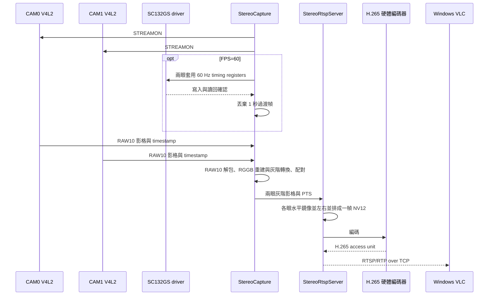

# 雙目 RAW10 → 各眼水平鏡像 → 左右並排 H.265 → RTSP 原型

## Bayer 網格修正（2026-10-06）

目前兩路 `pRAA` 是 RGGB Bayer RAW10。原先將每個感測器樣本直接當成
灰階，會把 R/G/G/B 感度差異顯示成規律的 2×2 網格，亮部尤其明顯。
現在每個擷取裝置獨自持有 `BayerLuma`：保留完整 10-bit 精度，先以
bilinear 重建 RGGB，再以 BT.709 權重轉成 8-bit 灰階，之後才做鏡像與
NV12 合成。邊界反射保留 CFA 相位；縮圖也先重建色彩，不直接抽取單一
CFA 相位。AE 同樣量測重建後的灰階。

板端轉換每眼約 5.1 ms。HDR 實測 180 組連號影格約 30.22 FPS，最大
接收 timestamp 差 305 µs；RTSP 軟體解碼取得 291 張相異的 2176×1280
畫面，約 30.31 FPS。下半部同一份 RAW 的 2×2 區塊亮度跨度中位數，
CAM0 從 98 降到 8、CAM1 從 107 降到 8（8-bit 灰階）。這些指標驗證
規律網格的改善，不表示隨機雜訊、過曝或其他影像問題均已消除。
對照與證據位於 `diagnostics/hdr-bottom-20261006/`。

後續固定在最下方約 1/5 的紋理是不同問題：HDR 外部觸發沿用了線性
模式的 `0x3225=0x04`。兩路 RAW A/B 只將該值改回 reset 預設
`0x00`，下方固定紋理便大幅減少；`0x3222=0x32`、HDR、輸出高度
1280 列與其他時序保留。單眼觸發降到 20 Hz 時，擷取跟隨為約 20 FPS，
沒有退回自行運行的 30 FPS。高度讀回正確，RAW 下方約 85% bytes 在
相鄰幀改變，排除了簡單缺列／殘留舊緩衝區的假說；降低觸發率到
20/25 Hz 也無法修正舊 `0x04` 的紋理。正式驅動已將 HDR FSYNC
表改為 `0x3225=0x00`，並在每次 STREAMON 讀回驗證。
先前的空間降噪只緩解症狀，現已從輸出路徑移除；保留正確的 Bayer
重建，不裁掉下方，不以濾波掩蓋 HDR 觸發設定錯誤。詳細對照位於
`diagnostics/bottom-fifth-20261006/`。
重啟載入新驅動後，600 組影格維持連號、約 30.08 FPS，最大接收
timestamp 差 314 µs；RTSP 軟體解碼取得 292 張相異的 2176×1280 畫面。

## VLC 串流與自動曝光（2026-10-01）

目前板端 RTSP 服務已接入 SC132GS 自動曝光控制。RTSP 擷取迴圈
在轉換後、未做畫面對比拉伸的兩眼灰階影像上量測亮度，並透過同一個
AE 控制程式設定兩顆感測器的曝光與類比增益。CLI 使用
/run/sc132gs-ae.sock；RTSP 服務運行時不必另開 sc132gs-ae-session，
因為兩者都需要獨占 /dev/video0 與 /dev/video3。
啟動時自動曝光預設開啟，目標亮度為 20%；可用 `BRIGHTNESS=1..90`
設定啟動目標。CLI 修改立即生效；服務重啟時會重新採用啟動目標。

Windows VLC 選擇「媒體 → 開啟網路串流」，輸入：

~~~text
rtsp://192.168.137.226:8554/stereo
~~~

在 RUBIK Pi 上調整目標亮度：

~~~sh
sudo sc132gs-ctl set-brightness 20
sudo sc132gs-ctl status
sudo sc132gs-ctl max-exposure-us 8000
sudo sc132gs-ctl auto off
~~~

2026-10-01 修正 VLC 連入後的板端服務退出：原程式在 appsrc 累積
24 幀時直接拋出錯誤。現在 appsrc 與編碼器前的 queue 都限制幀數，
慢速接收或編碼暫時落後時丟棄影格，擷取與 AE 繼續運作；
日誌的 `dropped_fps` 顯示擷取端因 appsrc 滿載而略過的幀數。
修正後 Windows RTSP/RTP over TCP 在 10 秒收到 599 個 H.265
access units（約 60.08 FPS）；Windows VLC 命令列連線 12 秒後
正常退出；模擬接收端停止讀取 12 秒再恢復，板端服務仍為 active。
VLC 視窗實際顯示率仍由播放器端決定。

同日修正 AE 的小幅亮度閃爍：原本曝光已到 60 FPS 上限時，
控制器仍會以不足的曝光增量交換兩級增益，之後又把增益加回；
量測影格週期的微小變化也會使曝光上限來回變動。現在僅在曝光
增量足以補償增益減量時才交換，並以整數 FPS 計算上限。
實機固定場景連續約 12 秒的狀態取樣中，曝光維持 1330 lines、
增益維持 72，兩眼亮度約 36% / 41–42%；RTSP/TCP 8 秒仍收到
480 個 H.265 access units（約 59.76 FPS）。這證實 AE 不再來回寫入
曝光與增益；VLC 畫面觀感仍需使用者確認。

60 FPS 時 AE 的曝光上限約 1330 lines（15.8 ms），類比增益最高為
128。若兩者到頂而場景仍偏暗，AE 會回報 `brightness_limited=1`；
這表示 sensor 已無更多進光餘裕。曾在 RTSP 輸出套用顯示亮度曲線，
但 VLC 畫面過白，現已移除；NV12 合成直接使用原始灰階，AE 也量測
原始 luma。Windows VLC 的「影像調整」效果已關閉。
偶發單次 V4L2 sequence 前向跳號會記錄並繼續串流；sequence 倒退
仍視為錯誤。

建置時 CMake 會從相鄰的 sc132gs_v4l2_probe 目錄取用 AE
來源；若來源位於其他位置，設定 SC132GS_AE_SOURCE_DIR。

此服務直接讀取兩路 SC132GS V4L2 packed RAW10，依 timestamp 配對並
轉為單一 NV12 畫面：**CAM0 在左，CAM1 在右，兩眼各自水平鏡像**。
每眼第 `x` 個輸出像素取自原影格的 `eye_width - 1 - x`；
不交換兩顆相機的位置，也不把整張合成圖一次翻轉。
RTSP 僅有一條 H.265 RTP
track。影格留在 Rubik Pi 的程序記憶體，不寫入影片檔。



## 解析度與 FPS

已驗證的雙目同步模式為共同 FSYNC 30 或 60 Hz。本原型直接擷取每一幀，
不主動抽幀；若任一相機 sequence 跳號，程式直接報錯。每五秒在 stderr
印出讀入、送進 GStreamer 與因佇列滿載而略過的平均 FPS。`submitted_fps` 代表送交編碼管線，
**不是**接收端已解碼的 FPS；下表另外記錄接收端量測。

預設 `DOWNSCALE=1`：每眼 1088×1280，RTSP 左右合成畫面為
2176×1280；實機已驗證 H.265 RTP 可經 Windows 區網以約 **60 FPS**
接收，板端偵測到的串流解析度為 2176×1280。新佈局尚未在 VLC
視窗直接確認顯示。
若需降低 CPU 轉換、硬體編碼及網路負載，可用 `DOWNSCALE=2`，
每眼改為 544×640，合成畫面為 1088×640。灰階使用 RAW10 每像素的高八位，UV 固定 128；
這是監看原型，不提供 ISP、去馬賽克或自動對比調整。

`FPS` 同時控制 FSYNC generator、sensor 切換及 RTSP 標示的影格率，
預設 30，目前程式接受至 60。60 Hz 時需先讓兩眼在原 slave 模式
STREAMON，再由 driver 的 `trigger_60fps` sysfs 介面寫入並讀回
`0x320e=0x05`、`0x320f=0x78`、`0x3222=0x00`。擷取器丟棄切換後
1 秒過渡幀，之後仍要求兩眼 timestamp 差在 500 us 內且 sequence
逐幀連號。只縮短曝光時間曾測得約 36 FPS，未達 60 FPS。
H.265 編碼器啟用 `vui_timing_info=1`，讓 VLC 辨識為 60 FPS。
60 FPS 的 sysfs 路徑目前固定對應本板 CAM0 的 `18-0032` 和 CAM1 的
`16-0030`；換板或換接線時須核對此對應。

### 120 FPS 可行性（目前全解析度路徑）

2026-10-01 讀回 RUBIK Pi 目前啟用的兩顆 camera endpoint：每個
`data-lanes` 只有一個 32-bit lane 編號 `0`，`link-frequencies` 為
600 MHz；CSI-2 DDR 每眼可用的標稱線速因此是 1.2 Gbit/s。
1088×1280 RAW10 在 120 FPS 的純像素資料就需要
`1088 × 1280 × 10 × 120 = 1,671,168,000 bit/s` **每眼**，
尚未計入 CSI 封包開銷。即使完全忽略開銷，一條 1.2 Gbit/s lane
的理論上限也只有約 86.2 FPS。因此目前的單 lane 設定無法完成
全解析度 120 FPS 雙目擷取，已取消在此設定上直接提高 `FPS` 的嘗試。
GS130WI [產品規格](https://developer.d-robotics.cc/accessories_stereo_camera_doc/en/stereo_camera_gs130wi/product_overview)
列有 2-lane、最高 120 FPS；若未來要重新評估，需先驗證兩條 lane
的實際接線、sensor mode 與接收端設定。其後還需評估合成影格
2176×1280@120 的 H.265 編碼能力；Qualcomm 對 QCS6490 的
[公開規格](https://www.qualcomm.com/content/dam/qcomm-martech/dm-assets/documents/qcs-qcm6490-soc-product-brief_87-28733-1-b.pdf)
標示最高 4K30 編碼。本結論僅針對目前 `DOWNSCALE=1` 的配置，
不把 sensor 規格的 120 FPS 誤認為整條 RTSP 路徑已可達成。

## 板端建置與執行

需要 `sc132gs` 雙路 V4L2 pipeline、共同 FSYNC 設定，以及原有的
`sc132gs-fsync-generator` 與 `prepare-sc132gs-sync-gpios`。板端確認依賴：

```sh
sudo apt install cmake pkg-config libgstreamer1.0-dev \
  libgstreamer-plugins-base1.0-dev libgstrtspserver-1.0-dev \
  gstreamer1.0-plugins-good gstreamer1.0-plugins-bad
for element in v4l2h265enc h265parse rtph265pay appsrc; do
  gst-inspect-1.0 "$element" >/dev/null || exit 1
done
cmake -S . -B build -DCMAKE_BUILD_TYPE=Release
cmake --build build -j2
sudo bash ./run-stereo-rtsp.sh
```

本板的全解析度 60 FPS 啟動命令：

```sh
sudo env BIND=192.168.137.226 DOWNSCALE=1 FPS=60 BRIGHTNESS=40 \
  bash ./run-stereo-rtsp.sh
```

預設只監聽 `127.0.0.1:8554`，本機 URL 為
`rtsp://127.0.0.1:8554/stereo`。RTSP 服務只提供 RTP over TCP。
若 VLC 位於另一台電腦，先在板端執行
`sudo env BIND=0.0.0.0 bash ./run-stereo-rtsp.sh`，
再於 VLC 選擇「媒體 → 開啟網路串流」，輸入
`rtsp://<Rubik-Pi-IP>:8554/stereo`。也可在板端用 VLC 開啟本機 URL。

本次另以 transient systemd unit 在板端啟動，監聽當時的 WLAN 位址
`192.168.137.226:8554`；Windows VLC 可開啟
`rtsp://192.168.137.226:8554/stereo`。這個 IP 可能隨網路改變。
查看或停止本次服務：

```sh
systemctl status stereo-h265-rtsp.service
sudo systemctl stop stereo-h265-rtsp.service
```

若板端已安裝 VLC，也可在板端以命令列開啟：

```sh
vlc rtsp://127.0.0.1:8554/stereo
```

以 `Ctrl-C` 停止後，腳本會停止自身啟動的 FSYNC generator。
本原型的左右位置與輸入 camera node 可用 `CAM0`、`CAM1` 調整；
`/dev/video0`、`/dev/video3` 只是當次開機的 V4L2 node。先安裝
`../sc132gs_v4l2_probe/sc132gs-discover.py` 到
`/usr/local/sbin/sc132gs-discover`；啟動腳本依啟用的 media links 解析
CAM0 (`0x32`) 與 CAM1 (`0x30`) 的節點，無法唯一對應時停止啟動。

## 驗證界線

### ARM NEON 轉換加速

`DOWNSCALE=1` 時，擷取器以 ARM NEON `TBL` 一次抽出 16 個 RAW10
像素的高八位；每列尾端由純量程式處理。各眼水平鏡像同樣在 AArch64
使用 NEON，每次反轉 16 個像素。`DOWNSCALE=2/4` 的 RAW10→灰階轉換
及非 AArch64 平台使用純量路徑；NV12 色度填入、H.265 編碼與 RTSP
仍沿用原路徑。

2026-10-01 在 RUBIK Pi 3 上以 Release 編譯，獨立逐 byte 對照測試
通過。對 1088×1280 影格各轉換 600 次，純量路徑耗時 288.1 ms，
NEON 路徑 63.0 ms，單項轉換約快 4.57 倍。這是 RAW10 轉灰階的微基準，
不是整條串流的加速倍率。實際兩眼相機以新程式擷取 600 對，
耗時 9.992 秒，平均 59.95 FPS；CAM0/CAM1 都逐幀連號，
最大 timestamp 差 344 us。可重跑：

```sh
ctest --test-dir build --output-on-failure
./build/raw10-luma-check --bench
# 先停止既有串流服務，釋放兩個 V4L2 node 和 FSYNC GPIO：
sudo systemctl stop stereo-h265-rtsp.service
sudo bash ./run-capture-check.sh 600 60
```

本板的 `stereo-h265-rtsp.service` 是 transient unit；停止後需用
`systemd-run` 重新建立，不能直接 `systemctl start`。本次測試後已恢復
服務。先前多次 RTSP 客戶端連線使 `msm_vidc` 回報 session 上限；
後續重新載入 `iris_vpu` 清理殘留 session，並完成下述 RTSP 驗證。
上面的 59.95 FPS 是擷取率，不能當成 VLC 顯示率。

### 左右並排並各眼鏡像版本驗證

2026-10-01 在 RUBIK Pi 3、`DOWNSCALE=1 FPS=60` 實測：
獨立測試用不同像素樣式檢查 CAM0/CAM1 各自水平鏡像、左右位置、
UV=128 與輸出邊界；通過 2、18、20、1088 像素寬的案例，
包含 NEON 向量與尾端純量路徑。切換實機服務後，Windows 區網
RTSP/TCP 在 8 秒收到 479 個 H.265 access units，**59.98 FPS**；
板端讀到 H.265 Main Profile、**2176×1280、60/1 FPS**，服務維持 active。
此測試驗證串流與程式內的像素排列，尚未直接在 Windows VLC
視窗確認鏡像後的畫面。

### 先前左右並排但未鏡像版本驗證（僅供對照）

2026-10-01 在 RUBIK Pi 3、`DOWNSCALE=1 FPS=60` 實測：左右並排
NV12 合成的像素位置、UV=128 與輸出邊界測試通過。重新載入
`iris_vpu` 清理先前殘留的 codec session 後，Windows 區網 RTSP/TCP
收到 479 個 H.265 access units，約 **59.98 FPS**；板端
`gst-discoverer-1.0` 讀到 H.265 Main Profile、**2176×1280、60/1 FPS**。
串流服務仍在板端運行。這次未在 Windows VLC 視窗直接確認畫面排列，
也未量測解碼顯示率。

### 先前上下排版本驗證（僅供對照）

2026-10-01 在 RUBIK Pi 3、`DOWNSCALE=1 FPS=60` 實測：板端 loopback
RTSP 在約 12 秒收到 **710 個 H.265 access units，60.06 FPS**；
板端硬體解碼取得 **711 幀，60.24 FPS**；Windows 區網 RTSP/TCP
收到 **714 個 access units，59.73 FPS**。Windows VLC 實際顯示
上下雙眼影像，媒體資訊為 **H.265、1088×2560、60 FPS**；VLC
「已顯示」計數在 16.1 秒增加 970 幀，約 **60.4 FPS**。
板端首次 60 FPS 連續運行約五分鐘，讀入約 18615 對，最近各五秒
讀入及送交編碼器約 60 FPS，沒有擷取 sequence gap。這些數字不代表
已完成更長時間熱穩定或端到端延遲量測。60 FPS 模式依賴本專案更新的
`sc132gs` driver 與對應 sysfs 介面。

2026-10-01 在 RUBIK Pi 3 實機以 `DOWNSCALE=2` 測試：雙路相機擷取
維持約 30 FPS、未見 sequence 跳號；以板端 loopback RTSP 客戶端接收
8 秒，取得 **235 個 H.265 access units、29.98 FPS**；再接板端
`v4l2h265dec` 取得 **235 個解碼影格、30.14 FPS**。
`verify_rtsp.py --seconds 8` 與 `--decode` 只計數，不保存影像。
Windows 端以 `verify_rtsp_tcp.py` 經區網收到 **237 個 H.265 access units，
29.91 FPS**；該程式只解析 RTSP/RTP header，不解碼、不保存影像。
Windows Legacy Media Player COM 嘗試同一 URL 18 秒，停在 `playState=9`
（Transitioning），未進入 Playing；因此不能聲稱該播放器可用。
Windows VLC 已透過相同 URL 實際解碼並連續顯示上下排列的雙相機灰階畫面；
播放約一分鐘時，板端服務仍為 active，最近五秒的讀入與送入編碼管線
平均值皆約 30 FPS。尚未量測 VLC 顯示 FPS、端到端延遲與長時間熱穩定性。

同日在 `DOWNSCALE=1` 下，板端 RTSP 測得 **233 個 H.265 access units，
30.07 FPS**；板端硬體解碼測得 **215 幀，30.27 FPS**（啟動時解碼器
曾報 23 幀未 dequeue）。Windows VLC 的媒體資訊確認 H.265、
**1088×2560、29.97 FPS**，實際顯示兩眼上下畫面；板端持續擷取與送入
編碼管線約 30 FPS。VLC 顯示端長時間穩定性仍待量測。

碼流會有單一 PTS，使用 CAM0 V4L2 timestamp 相對於第一個已送出影格
產生；CAM0/CAM1 必須在 500 us 的接收時間戳容許差內。RAW10→NV12
是 CPU 轉換與複製路徑，還沒有零拷貝或長時間熱穩定度量測。
RTSP URL 並未做加密或驗證。發佈至 LAN 前需按實際安全需求配置。
